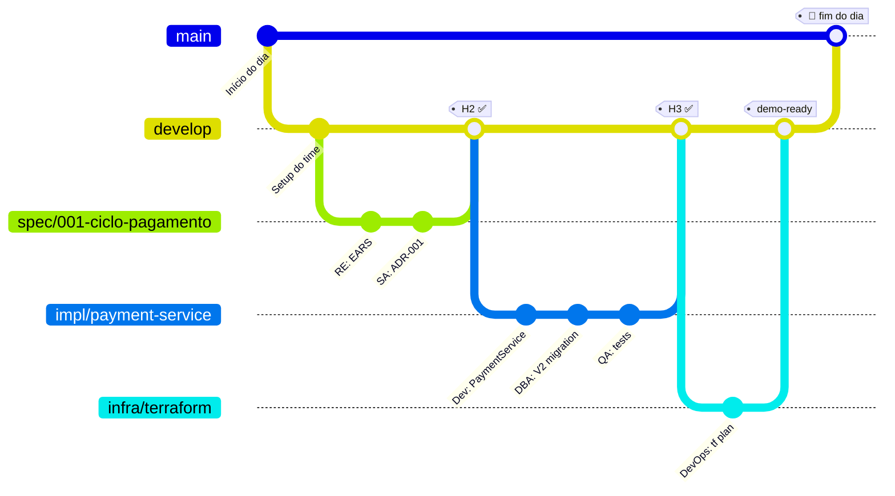

<!-- markdownlint-disable MD013 MD025 MD026 MD028 MD029 MD034 MD040 MD051 MD060 -->

# 🌿 Git Workflow do Time — cada persona em sua branch


> 🗺 **Você está aqui:** [Kit PT-BR](README.md) → **Git Workflow**

> **Para quem é isto?** Para todo o time, especialmente quem nunca usou **branch por feature** ou nunca abriu um **Pull Request com review**.
>
> **O que você terá ao final desta leitura:**
>
> 1. Saberá o que é "branch", "commit", "push", "PR" e "merge" — com analogia de save-point
> 2. Saberá qual nome de branch usar para cada estágio
> 3. Saberá a ordem de merge: branch → develop → main
> 4. Conhecerá as 5 regras de ouro
> 5. Saberá o comando salvador para cada situação de pânico

  

---

## 🎮 A analogia: save-points de Super Mario

| Conceito Git | 🍄 Equivalente em jogo | O que significa |
|---|---|---|
| `main` | 🏆 **Save final** — jogo zerado, mostrado pra mãe | Versão estável, demoável |
| `develop` | 💾 **Checkpoint da fase atual** | Versão integrada do dia |
| `spec/001-pagamento` | 🗺 **Sua quest pessoal** salvando só pra você | Branch onde você mexe |
| `git commit` | 💾 **Save rápido** (local, só você vê) | Marca uma versão local |
| `git push` | ☁️ **Backup na nuvem** (colegas podem ver) | Sobe para GitHub |
| **Pull Request (PR)** | 👀 **Mostrar o save** para os colegas validarem | Pede review antes de mergear |
| `git merge` | ✅ **Save oficial no servidor do time** | Junta sua branch na develop |
| **CI verde** | ⭐ **Estrela de invencibilidade** validou o save | Testes/lint passaram |
| **CI vermelho** | 🟫 **Goomba na cara** | Algo quebrou — corrija antes de mergear |
| **Conflict de merge** | 🔀 **Dois jogadores tentaram pegar a mesma moeda** | Você precisa escolher quem fica |

---

## 🌳 A árvore do dia (visual)



---

## 🏷 Como nomear sua branch (convenção por persona)

| Quem | Estágio | Prefixo de branch | Exemplo |
|---|---|---|---|
| RE + SA | 2 — Spec | `spec/<NNN>-<feature>` | `spec/001-ciclo-pagamento` |
| Dev + DBA | 3 — Impl | `impl/<modulo>-<feature>` | `impl/payment-cycle` |
| QA | 3 — Testes | `test/<feature>` | `test/payment-cycle-bdd` |
| DevOps | 4 — Infra | `infra/<componente>` | `infra/terraform-aca` |
| Tech Writer | Transversal | `docs/<topico>` | `docs/runbook` |
| Agent Mode | 4 — Delegação | `agent/<issue-NN>` | `agent/issue-42` |

> [!TIP]
> **Padrão de commit message:** sempre cite o REQ-ID ou Issue.
> Exemplo: `Implements REQ-PAY-001: gera ciclo mensal de pagamentos`.

---

## 🔄 A "dança do merge" — passo a passo

### Passo 1 · Criar sua branch a partir de `develop`

```bash
git checkout develop && git pull        # atualiza o checkpoint
git checkout -b spec/001-ciclo-pagamento  # cria sua quest
```

### Passo 2 · Trabalhar (save rápido a cada peça)

```bash
git add .
git commit -m "Implements REQ-PAY-001: ciclo mensal"
git push -u origin spec/001-ciclo-pagamento   # backup na nuvem
```

> [!NOTE]
> Faça **commits pequenos e frequentes**. Cada commit = 1 ideia, 1 moeda. Não junte 5 horas de trabalho num único commit "wip".

### Passo 3 · Abrir PR para `develop`

```bash
gh pr create \
  --base develop \
  --head spec/001-ciclo-pagamento \
  --title "spec/001: ciclo de pagamento" \
  --body "Implementa REQ-PAY-001/002/003.

  ## O que muda
  - Spec EARS (3 REQ-IDs)
  - ADR-002 sobre transações

  ## Source legacy
  - 01-arqueologia/legado-sifap/natural-programs/BATCHPGT.NSN#L120-L168

  ## Como testar
  - Veja seção 'acceptance' de cada REQ-ID"
```

### Passo 4 · CI roda (⭐ estrela ou 🟫 Goomba)

- **Verde** ⭐ → segue para Passo 5
- **Vermelho** 🟫 → leia o erro, corrija, faça novo commit, espera CI rodar de novo

### Passo 5 · Par receptor downstream revisa

| Você está no par… | Quem revisa seu PR |
|---|---|
| 1 (Visão) | Par 2 (Arquitetura) |
| 2 (Arquitetura) | Par 3 (Implementação) |
| 3 (Implementação) | Par 4 (Qualidade) |
| 4 (Qualidade) | Par 5 (Operações) |
| 5 (Operações) | Par 1 (Visão) |

### Passo 6 · Merge para `develop`

Depois do approve, clique **"Merge pull request"** no GitHub (ou `gh pr merge`). Use **squash merge** para manter histórico limpo.

### Passo 7 · Ao fim do estágio, líder abre PR `develop → main`

Só o líder do time faz este merge. É o save oficial do dia.

---

## 🛡 As 5 regras de ouro

> [!IMPORTANT]
> ### Sem exceção
>
> 1. 🚫 **Nunca commit direto em `main`.** Sempre via PR.
> 2. 🚫 **Nunca `git push --force` em branch compartilhada.** Use `--force-with-lease` se realmente precisar.
> 3. ✅ **Commit message sempre cita REQ-ID:** `Implements REQ-PAY-01: ...`.
> 4. ✅ **CI vermelho não merga.** Corrija primeiro.
> 5. ✅ **PR sem descrição não merga.** Descreva *o que* e *por quê*.

---

## ✍️ Templates de commit message

Copie e cole, adaptando o REQ-ID e a descrição.

### Por tipo de mudança

```bash
# Nova feature implementando REQ-ID
git commit -m "feat: Implements REQ-PAY-001 (ciclo mensal de pagamento)"

# Correção de bug
git commit -m "fix: corrige cálculo de desconto judicial em CALCDSCT (REQ-PAY-DSCT-01)"

# Documentação
git commit -m "docs: ADR-002 sobre transações Spring"

# Testes
git commit -m "test: cobertura de aceitação para REQ-BEN-03 (validação CPF)"

# Migração de banco
git commit -m "db: V2__add_payment_status (REQ-PAY-04)"

# Refactor sem mudança de comportamento
git commit -m "refactor: extrai PaymentValidator (mantém REQ-PAY-001)"

# Configuração / build / CI
git commit -m "chore: adiciona spec-quality.yml workflow"

# Agent Mode (Estágio 4)
git commit -m "agent: PR #42 — implementa notificação por email (REQ-PAY-NOTIF-01)"
```

### Regras para mensagens

- ✅ Primeira linha **≤ 72 caracteres**
- ✅ Começa com tipo: `feat:` `fix:` `docs:` `test:` `db:` `refactor:` `chore:` `agent:`
- ✅ Cita o REQ-ID quando aplica
- ❌ Não escreva `wip` ou `temp` — só commits "de verdade"

---

## 🏆 Achievements (gamificação opcional)

Marque na descrição do PR quando conquistar:

```markdown
## Achievements desbloqueadas neste PR

- 🍄 **Primeira regra BR-NNN extraída** com `Programa Fonte` preenchido
- ⭐ **Primeira EARS** com `source_legacy:` válido
- 📜 **ADR aprovada** pelo time
- 🚩 **CI verde no primeiro try**
- 🦖 **Endpoint REST funcionando** via Swagger
- 🧪 **Cobertura ≥70%** mantida
- 🎭 **PR do Agent revisado e mergeado**
- 🏰 **`terraform plan` sem erro**
```

> Não vale pontos. Vale **moral** do time. Quando todos riem dos badges, é sinal que está fluindo.

---

## 🆘 Comandos salvadores (de cabeça baixa)

| Situação | Comando |
|---|---|
| 😱 "Esqueci de criar branch e commitei na develop" | `git reset --soft HEAD~1 && git stash && git checkout -b nova-branch && git stash pop` |
| 😱 "Meu rebase tá um inferno" | `git rebase --abort` (sem culpa, recomeça) |
| 😱 "Conflito de merge!" | Abra o arquivo, achar `<<<<<<<`, escolher as linhas certas, `git add <arquivo> && git rebase --continue` |
| 😱 "Apaguei branch sem querer" | `git reflog` → ache o SHA → `git checkout -b nome SHA` |
| 😱 "Quero descartar últimas mudanças (não commitadas)" | `git restore .` |
| 😱 "Tudo deu errado, quero voltar 30 min atrás" | **Pare. Chame a Technical Lead.** Não tente sozinho. |

---

## 🧪 Mini-tutorial para quem nunca usou Git

Se hoje é seu primeiro contato com Git, faça este aquecimento de 5 minutos:

```bash
# 1. Ver onde você está
git status

# 2. Ver em que branch
git branch --show-current

# 3. Atualizar develop
git checkout develop
git pull

# 4. Criar sua primeira branch
git checkout -b docs/meu-primeiro-commit

# 5. Mexer num arquivo (ex: anotar seu nome em PERSONAS.md)
echo "# Olá mundo" >> docs/playground.md

# 6. Ver o que mudou
git diff
git status

# 7. Salvar (commit)
git add docs/playground.md
git commit -m "docs: primeiro commit do <seu nome>"

# 8. Subir
git push -u origin docs/meu-primeiro-commit

# 9. Abrir PR
gh pr create --base develop --title "docs: primeiro commit" --body "Aquecimento"
```

Se você completou os 9 passos, **você sabe Git o suficiente para o workshop**. O resto é variação dos mesmos verbos.

---

## ✅ Definition of Done — você está confortável com Git quando…

- [ ] Sabe criar uma branch a partir de `develop`
- [ ] Faz commits **pequenos** (1 ideia por commit) e **com REQ-ID** no message
- [ ] Sabe fazer `git push` da sua branch
- [ ] Sabe abrir um PR via `gh pr create` ou pelo site
- [ ] Sabe ler o status do CI no PR (verde/vermelho)
- [ ] Sabe quem revisa seu PR (par downstream)
- [ ] Sabe pedir ajuda **antes** de tentar `--force`

---

## 🔗 Para se aprofundar

- 📋 [00-SETUP.md — passos 3 e 4 sobre branch protection](00-SETUP.md)
- 🎯 [00-TEAM-FLOW.md — as 3 passagens (H1, H2, H3) entre pares](00-TEAM-FLOW.md)
- 📘 [Persona-agent matrix — quem depende de quem](docs/persona-agent-matrix.md)
- 🌐 [GitHub: gh CLI docs](https://cli.github.com/manual/)

---

### Continuar a leitura

<table width="100%">
<tr>
<td width="50%" valign="top" align="left">
<sub><strong>← ANTERIOR</strong></sub><br/>
<a href="00-TEAM-FLOW.md"><strong>TEAM-FLOW</strong></a><br/>
<sub>Cronograma do dia, passagens, regra dos 20 min, DoD.</sub>
</td>
<td width="50%" valign="top" align="right">
<sub><strong>PRÓXIMO →</strong></sub><br/>
<a href="01-arqueologia/GUIDE.md"><strong>Estágio 1 — Arqueologia</strong></a><br/>
<sub>Ler o legado e catalogar regras de negócio.</sub>
</td>
</tr>
</table>

<sub>↑ <a href="README.md">Voltar ao Kit PT-BR</a></sub>
