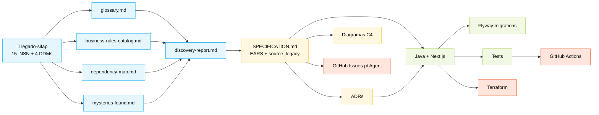

<!-- markdownlint-disable MD013 MD025 MD026 MD028 MD029 MD034 MD040 MD051 MD060 -->

# 🗺 SITEMAP — Mapa Visual do Kit

 

> 🗺 **Você está aqui:** [Kit PT-BR](README.md) → **Sitemap**

> **Para quem é isto?** Para você que se perdeu no meio do dia, ou para alguém perguntando onde está aquele arquivo.
>
> **O que você terá ao final desta leitura:**
>
> 1. Mapa visual de toda a estrutura do kit (numerada 00..12)
> 2. Caminho recomendado por persona (PO/RE, EA/SA, TL/Dev, DBA/QA, DevOps/TW)
> 3. Diagrama de **fluxo de artefatos** (quem alimenta quem)
> 4. Tabela "onde mora cada coisa"

 

---

## 🏰 Visão de 1 imagem (universo Mario)

```
                                                                       🏰
🟦 MUNDO 1 ──🟢cano──> 🟫 MUNDO 2 ──🟢cano──> 🟧 MUNDO 3 ──🟢cano──> CASTELO
01-arqueologia          02-spec-moderna        03-implementacao      04-evolucao
@archaeologist          @architect              @builder              @evolution
                                                                          │
                                                                          ▼
                                                                     👸 SIFAP 2.0
```

---

## 📍 Estrutura ordenada (00..12)

| Prefixo | Pasta/Arquivo | Quando consultar |
|---|---|---|
| **00** | [`README.md`](README.md) | Primeira chegada |
| **00** | [`00-COMECE-AQUI.md`](00-COMECE-AQUI.md) | 15 min para qualquer pessoa |
| **00** | [`00-SETUP.md`](00-SETUP.md) | Preparar laptop + Copilot |
| **00** | [`00-TEAM-FLOW.md`](00-TEAM-FLOW.md) | Cronograma canônico do dia |
| **00** | [`00-SITEMAP.md`](00-SITEMAP.md) | Este arquivo |
| **00** | [`00-GIT-WORKFLOW.md`](00-GIT-WORKFLOW.md) | Branches, PRs, merges |
| **01** | [`01-arqueologia/`](01-arqueologia/) | 🟦 ESTÁGIO 1 — ler legado |
| **01** | [`01-arqueologia/legado-sifap/`](01-arqueologia/legado-sifap/) | 15 .NSN + 4 DDMs |
| **02** | [`02-spec-moderna/`](02-spec-moderna/) | 🟫 ESTÁGIO 2 — EARS, ADRs, C4 |
| **03** | [`03-implementacao/`](03-implementacao/) | 🟧 ESTÁGIO 3 — Java + Next.js |
| **04** | [`04-evolucao/`](04-evolucao/) | 🏰 ESTÁGIO 4 — Agent + Terraform |
| **05** | [`05-personas/`](05-personas/) | 10 personas (escolha 2) |
| **06** | [`06-agentes-de-estagio/`](06-agentes-de-estagio/) | 4 agentes Copilot |
| **07** | [`07-conceitos/`](07-conceitos/) | 🧠 Analogias Mario, EARS, ADR |
| **08** | [`08-exemplos/`](08-exemplos/) | 📘 Artefatos prontos |
| **09** | [`09-cheat-sheets/`](09-cheat-sheets/) | 🎴 Cartões de 1 página |
| **11** | [`11-scripts/`](11-scripts/) | `setup.sh`, `check.sh` |
| **12** | [`12-plugins/`](12-plugins/) | GitHub Issues, Azure Boards |
| `docs/` | [`docs/`](docs/) | FAQ, troubleshooting, runbook, ADRs |
| `assets/` | [`assets/`](assets/) | SVGs e diagramas |
| `specs/` | [`specs/`](specs/) | Exemplo Spec-Kit |

---

## 🌊 Fluxo de artefatos (quem alimenta quem)



> **Como ler:** seta = dependência. Sem o artefato de origem, o destino não pode começar bem feito.

---

## 🧑‍🤝‍🧑 Caminho recomendado por persona

| Você é… | Comece por… | Depois… | Depois… |
|---|---|---|---|
| **Qualquer pessoa, primeira vez** | [00-COMECE-AQUI.md](00-COMECE-AQUI.md) | [00-TEAM-FLOW.md](00-TEAM-FLOW.md) | seu `PERSONA.md` |
| **Líder do time** | [00-SETUP.md](00-SETUP.md) | [00-TEAM-FLOW.md](00-TEAM-FLOW.md) | [05-personas/OVERVIEW.md](05-personas/OVERVIEW.md) |
| **PO ou RE (Par 1)** | [05-personas/01-product-owner/PERSONA.md](05-personas/01-product-owner/PERSONA.md) | [01-arqueologia/GUIDE.md](01-arqueologia/GUIDE.md) | [02-spec-moderna/GUIDE.md](02-spec-moderna/GUIDE.md) |
| **EA ou SA (Par 2)** | [05-personas/03-enterprise-architect/PERSONA.md](05-personas/03-enterprise-architect/PERSONA.md) | [08-exemplos/ADR-001-monolito-modular-exemplo.md](08-exemplos/ADR-001-monolito-modular-exemplo.md) | [02-spec-moderna/GUIDE.md](02-spec-moderna/GUIDE.md) |
| **TL ou Dev (Par 3)** | [05-personas/06-developer/PERSONA.md](05-personas/06-developer/PERSONA.md) | [08-exemplos/PaymentService-exemplo.java](08-exemplos/PaymentService-exemplo.java) | [03-implementacao/GUIDE.md](03-implementacao/GUIDE.md) |
| **DBA ou QA (Par 4)** | [05-personas/07-dba/PERSONA.md](05-personas/07-dba/PERSONA.md) | [08-exemplos/V1__init_payment_module-exemplo.sql](08-exemplos/V1__init_payment_module-exemplo.sql) | [03-implementacao/GUIDE.md](03-implementacao/GUIDE.md) |
| **DevOps ou TW (Par 5)** | [05-personas/09-devops-engineer/PERSONA.md](05-personas/09-devops-engineer/PERSONA.md) | [08-exemplos/issue-para-agent-exemplo.md](08-exemplos/issue-para-agent-exemplo.md) | [04-evolucao/GUIDE.md](04-evolucao/GUIDE.md) |
| **Não programa em Natural** | [01-arqueologia/legado-sifap/COMO-LER-NATURAL.md](01-arqueologia/legado-sifap/COMO-LER-NATURAL.md) | [01-arqueologia/GUIDE.md](01-arqueologia/GUIDE.md) | (sua persona) |
| **Encontrou termo estranho** | [07-conceitos/03-glossario-visual.md](07-conceitos/03-glossario-visual.md) | (volte de onde veio) | — |

---

## 🆘 Se você se perdeu

1. **Não sabe em qual estágio está?** → [`00-TEAM-FLOW.md`](00-TEAM-FLOW.md) §2 (cronograma)
2. **Não sabe o que sua persona faz?** → seu [`05-personas/0X-.../PERSONA.md`](05-personas/OVERVIEW.md)
3. **Não sabe o que entregar?** → `GUIDE.md` do estágio atual → seção "Como saber que terminou (DoD)"
4. **Achou um termo estranho?** → [`07-conceitos/03-glossario-visual.md`](07-conceitos/03-glossario-visual.md)
5. **Algo deu errado?** → [`docs/troubleshooting.md`](docs/troubleshooting.md)
6. **Travou há mais de 20 min?** → Levante a mão. Regra do TEAM-FLOW §6.

---

### Continuar a leitura

<table width="100%">
<tr>
<td width="50%" valign="top" align="left">
<sub><strong>← ANTERIOR</strong></sub><br/>
<a href="README.md"><strong>Kit PT-BR</strong></a><br/>
<sub>Hub deste folder.</sub>
</td>
<td width="50%" valign="top" align="right">
<sub><strong>PRÓXIMO →</strong></sub><br/>
<a href="00-COMECE-AQUI.md"><strong>00 — Comece aqui</strong></a><br/>
<sub>Roteiro inicial de 15 minutos.</sub>
</td>
</tr>
</table>

<sub>↑ <a href="README.md">Voltar ao Kit PT-BR</a></sub>

— Paula
