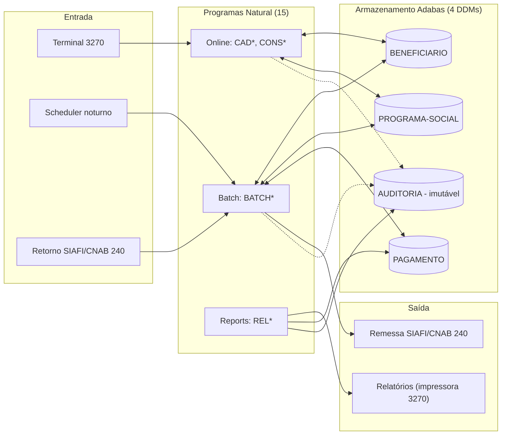
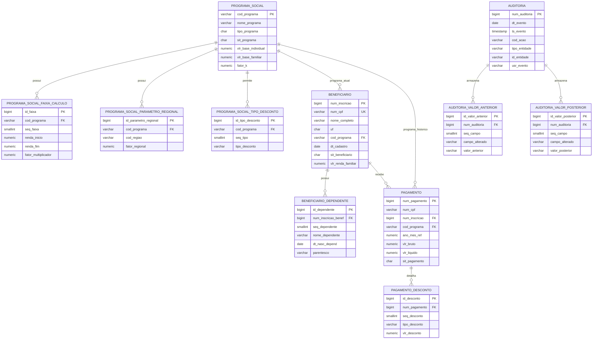

<!-- markdownlint-disable MD013 MD025 MD026 MD028 MD029 MD034 MD040 MD051 MD060 -->

# Mapa de Dependências — SIFAP Legado

  

> 🗺 **Você está aqui:** [Kit PT-BR](../README.md) → [Estágio 1](README.md) → **dependency-map**

> **Para quem é isto?** Este é um **artefato preenchido pelo time** durante o Estágio 1 (Arqueologia).
>
> **O que você terá ao final do estágio:**
>
> 1. Este documento totalmente preenchido com os dados reais do legado SIFAP
> 2. Rastreabilidade para `01-arqueologia/legado-sifap/` (programas `.NSN` e DDMs)
> 3. Base de evidência usada nas EARS do Estágio 2 (`source_legacy:`)
>
> 📘 **Guia passo a passo:** [`GUIDE.md`](GUIDE.md).

> Use diagramas Mermaid para mapear as dependências entre programas Natural e DDMs Adabas.
> O objetivo é visualizar "quem chama quem" e "quem lê/escreve o quê".

## Como descobrir dependências

- Use `grep` ou Copilot Chat para listar todas as ocorrências de `CALLNAT` nos 15 arquivos `.NSN`.
- Prompt útil: _"Liste todas as ocorrências de CALLNAT nestes arquivos e desenhe um diagrama Mermaid."_
- Para leitura/escrita em DDMs: procure por `READ`, `READ LOGICAL`, `STORE`, `UPDATE`, `DELETE`.

## Diagrama de Dependências entre Programas

> Mapa real cobrindo os **15 programas** Natural e os **4 DDMs** Adabas.

```mermaid
flowchart TD
  subgraph Online["Programas Online (Terminal 3270)"]
    CADBENEF["CADBENEF.NSN<br/>Cadastro Beneficiário"]
    CONSBENF["CONSBENF.NSN<br/>Consulta Beneficiário"]
    CADDEPEND["CADDEPEND.NSN<br/>Cadastro Dependente"]
    CADPROG["CADPROG.NSN<br/>Cadastro Programa Social"]
  end

  subgraph Batch["Programas Batch (Noturnos)"]
    BATCHPGT["BATCHPGT.NSN<br/>Ciclo mensal pagamento"]
    BATCHCON["BATCHCON.NSN<br/>Consultas em lote"]
    BATCHREL["BATCHREL.NSN<br/>Relatórios em lote"]
  end

  subgraph Reports["Relatórios"]
    RELPGT["RELPGT.NSN<br/>Relatório de pagamentos"]
    RELAUDIT["RELAUDIT.NSN<br/>Relatório de auditoria"]
  end

  subgraph Sub["Subprogramas (CALLNAT)"]
    CALCBENF["CALCBENF.NSN<br/>Cálculo benefício"]
    CALCDSCT["CALCDSCT.NSN<br/>Cálculo descontos"]
    CALCCORR["CALCCORR.NSN<br/>Correção monetária"]
    VALELEG["VALELEG.NSN<br/>Validação elegibilidade"]
    VALBENEF["VALBENEF.NSN<br/>Validação cadastro"]
    VALDOCS["VALDOCS.NSN<br/>Validação documentos"]
  end

  subgraph DDMs["DDMs Adabas"]
    DDM_BENEF[("BENEFICIARIO")]
    DDM_PGTO[("PAGAMENTO")]
    DDM_PROG[("PROGRAMA-SOCIAL")]
    DDM_AUD[("AUDITORIA")]
  end

  CADBENEF -->|CALLNAT| VALBENEF
  CADBENEF -->|CALLNAT| VALDOCS
  CADBENEF -->|STORE/UPDATE| DDM_BENEF
  CADBENEF -.->|log| DDM_AUD

  CADDEPEND -->|UPDATE| DDM_BENEF
  CADDEPEND -.->|log| DDM_AUD

  CADPROG -->|STORE/UPDATE| DDM_PROG
  CADPROG -.->|log| DDM_AUD

  CONSBENF -->|READ| DDM_BENEF
  CONSBENF -.->|log CO| DDM_AUD

  BATCHPGT -->|CALLNAT| VALELEG
  BATCHPGT -->|CALLNAT| CALCBENF
  BATCHPGT -->|CALLNAT| CALCDSCT
  BATCHPGT -->|READ ordenado CPF| DDM_BENEF
  BATCHPGT -->|READ| DDM_PROG
  BATCHPGT -->|STORE| DDM_PGTO
  BATCHPGT -.->|log BT| DDM_AUD

  BATCHCON -->|READ| DDM_BENEF
  BATCHCON -->|READ| DDM_PGTO

  BATCHREL -->|CALLNAT| RELPGT
  BATCHREL -->|CALLNAT| RELAUDIT

  RELPGT -->|READ| DDM_PGTO
  RELAUDIT -->|READ filtra EX| DDM_AUD

  CALCBENF -->|READ| DDM_PROG
  CALCBENF -->|READ| DDM_BENEF
  CALCDSCT -->|READ| DDM_BENEF
  CALCCORR -->|READ| DDM_PROG
  VALELEG -->|READ| DDM_PROG
  VALELEG -->|READ| DDM_BENEF
```

> Linhas pontilhadas = escrita em `AUDITORIA` (cross-cutting, todos os programas online/batch logam).

## Diagrama de Fluxo de Dados (DDMs)

## Tabela de Dependências

| Programa | Chama (CALLNAT) | Lê (READ) DDMs | Escreve (STORE/UPDATE) DDMs | Observações |
|---|---|---|---|---|
| CADBENEF.NSN | VALBENEF, VALDOCS | BENEFICIARIO, PROGRAMA-SOCIAL | BENEFICIARIO, AUDITORIA | Ponto de entrada online. |
| CADDEPEND.NSN | VALDOCS | BENEFICIARIO | BENEFICIARIO (PE GRP-DEPENDENTE), AUDITORIA | Limite 10 dependentes (REQ-BEN-03). |
| CADPROG.NSN | — | PROGRAMA-SOCIAL | PROGRAMA-SOCIAL, AUDITORIA | Mantém parâmetros (faixas, fatores, FATOR-K). |
| CONSBENF.NSN | — | BENEFICIARIO, PAGAMENTO | AUDITORIA (CO) | Read-only. Loga consulta. |
| BATCHPGT.NSN | VALELEG, CALCBENF, CALCDSCT | BENEFICIARIO (ordem CPF), PROGRAMA-SOCIAL | PAGAMENTO, AUDITORIA (BT) | Ciclo mensal. Idempotente por `(CPF,COMPETENCIA)` (BR-012). |
| BATCHCON.NSN | — | BENEFICIARIO, PAGAMENTO | — | Lê em lote para órgãos de controle (TCU, CGU). |
| BATCHREL.NSN | RELPGT, RELAUDIT | — | — | Orquestrador noturno de relatórios. |
| RELPGT.NSN | — | PAGAMENTO | — | Relatório de pagamentos. |
| RELAUDIT.NSN | — | AUDITORIA | — | **Filtra ações `EX` na exibição** (mistério — OQ-02). |
| CALCBENF.NSN | CALCCORR | PROGRAMA-SOCIAL, BENEFICIARIO | — | Fórmula central (BR-002). |
| CALCDSCT.NSN | — | BENEFICIARIO | — | Aplica descontos (BR-009, BR-010, BR-011). |
| CALCCORR.NSN | — | PROGRAMA-SOCIAL | — | Aplica `FATOR_REAJUSTE`. |
| VALELEG.NSN | — | PROGRAMA-SOCIAL, BENEFICIARIO | — | Regras por tipo (BR-014, BR-015, BR-016). |
| VALBENEF.NSN | — | BENEFICIARIO | — | Valida CPF e duplicidade. |
| VALDOCS.NSN | — | — | — | Valida formato de documentos. |

## Dependências Circulares

- **Nenhuma** dependência circular encontrada. Grafo é acíclico.

## Programas Órfãos

- **Nenhum órfão**. Todos os 15 programas são alcançáveis a partir de uma das 4 entradas: Terminal 3270 (CAD*/CONS*), Scheduler noturno (BATCH*), Sub-rotinas (CALC*/VAL* — chamados via `CALLNAT`), Relatórios (REL* — chamados por `BATCHREL`).

## Diagrama ER do Modelo PostgreSQL Inicial

> Derivado dos 4 DDMs Adabas e materializado em `01-arqueologia/legado-sifap/sifap-postgresql-schema.sql`.

> Observações:
>
> - `beneficiario.cod_programa` representa o vínculo atual do cadastro.
> - `pagamento.cod_programa` preserva o programa histórico da competência processada.
> - `auditoria` e tabelas filhas são tratadas como append-only no modelo SQL.

---

### Continuar a leitura

<table width="100%">
<tr>
<td width="50%" valign="top" align="left">
<strong>← ANTERIOR</strong> 
<a href="business-rules-catalog.md"><strong>business-rules-catalog.md</strong></a> 
Catálogo de regras.
</td>
<td width="50%" valign="top" align="right">
<strong>PRÓXIMO →</strong> 
<a href="discovery-report.md"><strong>discovery-report.md</strong></a> 
Síntese final.
</td>
</tr>
</table>

↑ <a href="README.md">Voltar ao Kit PT-BR</a>

