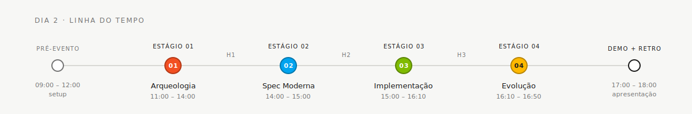

<!-- markdownlint-disable MD013 MD025 MD026 MD028 MD029 MD034 MD040 MD051 MD060 -->

# Estágio 2 — Spec Moderna

  

> 🗺 **Você está aqui:** [Kit PT-BR](../README.md) → **Estágio 2**

> **Para quem é isto?** Quem está chegando no estágio de spec moderna e quer a visão geral.
>
> **O que você terá ao final desta leitura:**
>
> 1. Saberá quem lidera (Par 2) e quem apoia
> 2. Verá quais entregáveis: EARS + ADRs + C4 L1/L2
> 3. Encontrará o template ADR e exemplos preenchidos
> 4. Link direto para o GUIDE detalhado

> Escreva a especificação modernizada do SIFAP usando notação EARS, crie Arquitetura Decision Records (ADRs) e defina as fronteiras de escopo.

## Onde isso encaixa no SDLC

## Quem trabalha aqui

## Conteúdo

| Arquivo                                    | Propósito                                |
| ------------------------------------------ | ---------------------------------------- |
| [`GUIDE.md`](GUIDE.md)                     | Guia passo a passo deste estágio         |
| [`ADR-TEMPLATE.md`](ADR-TEMPLATE.md)       | Modelo de Registro de Decisão Arquitetural |
| [`scope-decisions.md`](scope-decisions.md) | Modelo de decisões de escopo           |

---

### Continuar a leitura

<table width="100%">
<tr>
<td width="50%" valign="top" align="left">
<strong>← ANTERIOR</strong> 
<a href="../01-arqueologia/README.md"><strong>Estágio 1 — Visão geral</strong></a> 
Resumo da arqueologia + links para o GUIDE detalhado.
</td>
<td width="50%" valign="top" align="right">
<strong>PRÓXIMO →</strong> 
<a href="GUIDE.md"><strong>Estágio 2 — Spec Moderna</strong></a> 
14:00–15:00 · Escrever EARS, ADRs e diagramas C4.
</td>
</tr>
</table>

↑ <a href="../README.md">Voltar ao Kit PT-BR</a>

— Paula
