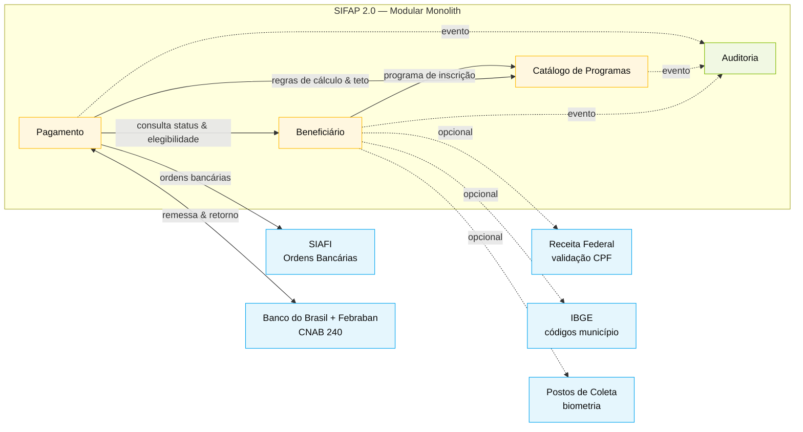

<!-- markdownlint-disable MD013 MD025 MD033 MD040 -->

# Bounded Contexts — SIFAP 2.0

> Par 2 · Arquitetura (EA + SA) · Estágio 2 · Modular Monolith
> Fundamentado em leitura direta dos 4 DDMs e dos NSNs `CALCBENF`, `BATCHPGT`, `VALELEG`, `CALCDSCT`.

## Critérios de Avaliação

Cada hipótese de recorte foi avaliada contra três critérios (escala **High / Medium / Low**):

| Critério | Pergunta | Como medi |
|---|---|---|
| **Coesão** | As regras deste grupo se relacionam à mesma capacidade de negócio? | Contei regras (`BR-*`) que pertencem ao grupo e verifiquei se respondem à mesma pergunta de negócio. |
| **Acoplamento** | Quantas arestas cruzam a fronteira? | Contei dependências NSN→NSN e DDM compartilhados que cruzariam. Baixo = bom. |
| **Frequência de mudança** | Os artefatos do grupo costumam mudar juntos no histórico legado? | Usei os cabeçalhos `ALTERADO:` dos DDMs/NSNs e os ownership notes (SENARC, CGTI, MDAS). |

> ⚠️ **Nota metodológica**: o `discovery-report.md` do Par 1 está como template vazio. As hipóteses abaixo foram derivadas diretamente da leitura dos 4 DDMs e dos NSNs `CALCBENF`, `BATCHPGT`, `VALELEG`, `CALCDSCT` (ver [archaeology notes](#fontes-utilizadas-na-avaliação)). Quando o Par 1 finalizar o discovery, esta seção deve ser revisada à luz das hipóteses formais.

## Avaliação de Hipóteses

### H1 — "Beneficiário" (cadastro + dependentes + biometria + endereço) — **ACEITA**

| Critério | Score | Evidência |
|---|---|---|
| Coesão | **High** | Todas as regras giram em torno do indivíduo: identidade, vínculo familiar, situação. `BENEFICIARIO.ddm` agrega 52 campos numa única entidade lógica. |
| Acoplamento | **Medium** | Lido por Pagamento (cálculo) e Catálogo (elegibilidade), mas **escrito** apenas aqui. Direção das dependências é clara. |
| Frequência de mudança | **Medium** | Mudanças históricas: biometria em 2005, contato em 2015 — ambas dentro do escopo de "quem é o beneficiário". |

**Recomendação**: aceitar. **Decisão da equipe**: aceita.

### H2 — "Catálogo de Programas Sociais" (programas + elegibilidade + faixas) — **ACEITA**

| Critério | Score | Evidência |
|---|---|---|
| Coesão | **High** | Tabela paramétrica única (`PROGRAMA-SOCIAL.ddm`, 45 registros). Regras de elegibilidade em `VALELEG.NSN` lêem só este DDM + um Beneficiário. |
| Acoplamento | **Low** | Apenas leitura por outros contextos; nenhum escreve aqui. Owner organizacional distinto (SENARC). |
| Frequência de mudança | **Low** | Mudanças raras (`ALTERADO: 22/03/2002`, `14/08/2008`, `05/06/2015`) — quase sempre por nova lei/decreto. |

**Recomendação**: aceitar. **Decisão da equipe**: aceita.

### H3 — "Pagamento" (cálculo + descontos + ciclo + conciliação + SIAFI) — **ACEITA**

| Critério | Score | Evidência |
|---|---|---|
| Coesão | **High** | Tudo gira em torno do aggregate `PAGAMENTO` (180 M registros). Cálculo (`CALCBENF`), descontos (`CALCDSCT`) e batch (`BATCHPGT`) lêem-se mutuamente. |
| Acoplamento | **Medium** | Lê Beneficiário e Catálogo (sempre como source-of-truth externos); escreve apenas Pagamento. Integrações externas (SIAFI, CNAB) encapsuladas via adapter. |
| Frequência de mudança | **High** | DDM alterado 4× (1999, 2002, 2005, 2015). É o contexto que mais evolui — justifica isolamento para reduzir blast radius. |

**Recomendação**: aceitar. **Decisão da equipe**: aceita.

### H4 — "Auditoria" (trilha imutável cross-cutting) — **ACEITA (como contexto separado)**

| Critério | Score | Evidência |
|---|---|---|
| Coesão | **High** | Um único aggregate (`EventoAuditoria`), uma única regra (imutabilidade), uma única exigência regulatória (IN-TCU 63/2010). |
| Acoplamento | **Low (entrada) / Zero (saída)** | Recebe eventos de todos; nenhum outro contexto lê dela. Direção 1-way. |
| Frequência de mudança | **Low** | `ALTERADO: 15/04/2005, 09/02/2012` — campos adicionados, schema estável. |

**Recomendação**: aceitar como contexto isolado (não cross-cutting library). **Decisão da equipe**: aceita — owner regulatório (TCU/CGU) é distinto dos demais, e a obrigação de retenção por 10 anos justifica fronteira física.

### H5 — "Conciliação Bancária" como contexto próprio — **REJEITADA**

| Critério | Score | Evidência |
|---|---|---|
| Coesão | **High** internamente | Mas dentro do ciclo de vida do `Pagamento` — não é capacidade independente. |
| Acoplamento | **Very High** com Pagamento | Compartilha aggregate (`PAGAMENTO.GA-GE` é parte do mesmo registro). |
| Frequência de mudança | **Same as Payment** | Sempre alterada junto com o ciclo. |

**Recomendação**: rejeitar como contexto próprio; tratar como **submódulo interno de Pagamento** (`pagamento.integracao.cnab`). **Decisão da equipe**: rejeitada — concorda com a recomendação.

### H6 — "Relatórios" como contexto próprio — **REJEITADA**

**Racional**: não é capacidade de negócio, é canal de leitura. Resolvido com views/queries sobre os 4 contextos. Equipe concordou.

### H7 — "Cálculo de Benefício" como contexto próprio — **REJEITADA**

**Racional**: é uma **operação** do aggregate Pagamento (CALCBENF.NSN sempre escreve em `PAGAMENTO` ao final). Extraí-la quebraria coesão sem benefício mensurável. Equipe concordou.

### Fontes utilizadas na avaliação

- [`01-arqueologia/legado-sifap/adabas-ddms/BENEFICIARIO.ddm`](../01-arqueologia/legado-sifap/adabas-ddms/BENEFICIARIO.ddm)
- [`01-arqueologia/legado-sifap/adabas-ddms/PAGAMENTO.ddm`](../01-arqueologia/legado-sifap/adabas-ddms/PAGAMENTO.ddm)
- [`01-arqueologia/legado-sifap/adabas-ddms/PROGRAMA-SOCIAL.ddm`](../01-arqueologia/legado-sifap/adabas-ddms/PROGRAMA-SOCIAL.ddm)
- [`01-arqueologia/legado-sifap/adabas-ddms/AUDITORIA.ddm`](../01-arqueologia/legado-sifap/adabas-ddms/AUDITORIA.ddm)
- [`01-arqueologia/legado-sifap/natural-programs/CALCBENF.NSN`](../01-arqueologia/legado-sifap/natural-programs/CALCBENF.NSN)
- [`01-arqueologia/legado-sifap/natural-programs/BATCHPGT.NSN`](../01-arqueologia/legado-sifap/natural-programs/BATCHPGT.NSN)
- [`01-arqueologia/legado-sifap/natural-programs/VALELEG.NSN`](../01-arqueologia/legado-sifap/natural-programs/VALELEG.NSN)
- [`01-arqueologia/legado-sifap/natural-programs/CALCDSCT.NSN`](../01-arqueologia/legado-sifap/natural-programs/CALCDSCT.NSN)

---

## 4 contextos identificados

| # | Contexto | Aggregate raiz | Volume legado | DDM legado | NSNs líderes |
|---|---|---|---|---|---|
| 1 | **Beneficiário** | `Beneficiario` (com `Dependente` PE, endereço, biometria, contato) | ~4,2 M | [`BENEFICIARIO.ddm`](../01-arqueologia/legado-sifap/adabas-ddms/BENEFICIARIO.ddm) | `CADBENEF.NSN`, `CADDEPEND.NSN`, `CONSBENF.NSN`, `VALBENEF.NSN`, `VALDOCS.NSN` |
| 2 | **Catálogo de Programas Sociais** | `ProgramaSocial` (com `FaixaCalculo` PE, `ParametroRegional` PE, `TipoDescontoAplicavel` MU) | ~45 ativos | [`PROGRAMA-SOCIAL.ddm`](../01-arqueologia/legado-sifap/adabas-ddms/PROGRAMA-SOCIAL.ddm) | `CADPROG.NSN`, `VALELEG.NSN` |
| 3 | **Pagamento** | `Pagamento` (com `Desconto` PE, dados bancários, integração SIAFI, conciliação) | ~180 M (3,8M/mês) | [`PAGAMENTO.ddm`](../01-arqueologia/legado-sifap/adabas-ddms/PAGAMENTO.ddm) | `CALCBENF.NSN`, `CALCDSCT.NSN`, `CALCCORR.NSN`, `BATCHPGT.NSN`, `BATCHCON.NSN`, `RELPGT.NSN` |
| 4 | **Auditoria** *(cross-cutting, somente leitura para os demais)* | `EventoAuditoria` (imutável, retenção ≥10 anos por IN-TCU 63/2010) | ~25 M | [`AUDITORIA.ddm`](../01-arqueologia/legado-sifap/adabas-ddms/AUDITORIA.ddm) | `RELAUDIT.NSN`, `BATCHREL.NSN` |

## Mapa de contextos (Mermaid)

## Responsabilidades por contexto

### 1. Beneficiário

**Owns:** identidade civil, documentos (RG, CPF, dependentes), endereço normalizado, biometria, contato, situação cadastral (`A`/`S`/`C`/`I`/`D`).
**Não owns:** regras de elegibilidade (Catálogo), cálculo de valor (Pagamento).
**Publica:** `BeneficiarioCadastrado`, `SituacaoBeneficiarioAlterada`, `DependenteIncluido`.

### 2. Catálogo de Programas Sociais

**Owns:** programas (`PBF`, `BPC`, `PETI`…), valores-base, tetos/pisos, fator-K, faixas de cálculo, parâmetros regionais, regras de elegibilidade (renda max, faixa etária, exige docs/biometria).
**Não owns:** cálculo concreto (Pagamento) nem inscrição do beneficiário (Beneficiário).
**Publica:** `ProgramaAtualizado`, `FatorRegionalReajustado`.

> ⚠️ **MISTÉRIO HERDADO**: campo `FATOR-K` em `PROGRAMA-SOCIAL.BG` está sem documentação desde 08/2008 (DDM linha 36-40). **Decisão arquitetural**: mapear como campo opaco preservado, NÃO usar em fórmulas até a SENARC esclarecer (ver [ADR-002](ADRs/ADR-002-mapeamento-adabas-postgresql.md)).

### 3. Pagamento

**Owns:** ciclo de cálculo mensal, fórmula de benefício, descontos, geração de ordem bancária, conciliação CNAB, integração SIAFI.
**Depende de** (read-only via interface): Beneficiário (status, dependentes, renda, região, data nascimento), Catálogo (valor-base, fator-reajuste, tipo, tetos).
**Publica:** `PagamentoGerado`, `PagamentoConfirmado`, `PagamentoDevolvido`, `CicloMensalConcluido`.

### 4. Auditoria (cross-cutting)

**Owns:** trilha imutável de eventos com estado antes/depois, retenção legal ≥10 anos.
**Consome** eventos de todos os demais via Spring Application Events.
**Anti-corruption layer**: nenhum outro contexto lê de Auditoria — apenas escreve.

> ⚠️ **MISTÉRIO HERDADO**: `RELAUDIT.NSN` filtra ações `EX` (exclusão) na exibição mas elas existem no arquivo ([`AUDITORIA.ddm` linhas finais](../01-arqueologia/legado-sifap/adabas-ddms/AUDITORIA.ddm)). **Decisão**: na 2.0 não há filtro — exclusões são exibidas. ADR pendente se cliente exigir paridade exata.

## Anti-corruption Layers (ACL)

| Fronteira | Tipo | Por quê |
|---|---|---|
| Pagamento → Beneficiário | Interface Spring (`BeneficiarioQueryPort`) | Evita acoplamento ao schema; permite trocar fonte (legado vs 2.0) durante strangler |
| Pagamento → Catálogo | Interface Spring (`ProgramaCatalogPort`) | Mesmo motivo + tabela fica cacheada (45 registros) |
| Pagamento ↔ SIAFI | Adapter dedicado (`SiafiOrderAdapter`) | Protocolo legado (campos `NUM-OB-SIAFI`, `NUM-NE-SIAFI`, `COD-UG-EMITENTE`) — fora do domínio |
| Pagamento ↔ Banco | Adapter CNAB 240 (`CnabRemessaAdapter`, `CnabRetornoAdapter`) | Mantém hash SHA-256 (`HASH-ARQ-REMESSA`/`HASH-ARQ-RETORNO`) por exigência regulatória |
| Tudo → Auditoria | Spring `ApplicationEventPublisher` | One-way; auditoria não responde |

## Critérios de divisão (por que estes 4, não outros)

- **Coesão por ciclo de vida do dado**: Beneficiário muda devagar (semanas); Pagamento muda em ciclo mensal; Catálogo muda em janelas (mudanças de lei); Auditoria nunca muda.
- **Coesão por owner organizacional** (do próprio legado): SENARC mexe em Catálogo; MDS/MDAS mexe em Beneficiário; coordenação de Pagamentos mexe em Pagamento; TCU/CGU lê Auditoria.
- **Cardinalidade dos descritores Adabas**: `PAGAMENTO.S1 = CPF+COMPETENCIA` define a chave natural de Pagamento, separada de `BENEFICIARIO.S1 = CPF`.

## O que NÃO virou bounded context (e por quê)

| Candidato rejeitado | Por quê |
|---|---|
| "Conciliação Bancária" | É só uma capacidade dentro de Pagamento — mesmo aggregate, mesmo ciclo. Submódulo, não contexto. |
| "Cálculo de Benefício" | Mesma razão — é uma operação de domínio do contexto Pagamento. |
| "Relatórios" | Não é negócio; é canal de leitura. Implementado como query views sobre os 4 contextos. |
| "Usuário / Autenticação" | Capacidade de plataforma — OAuth2/JWT centralizado, não bounded context de negócio. |

---

**Próximo artefato:** [`c4-context.md`](c4-context.md) — diagrama C4 L1 e L2.
