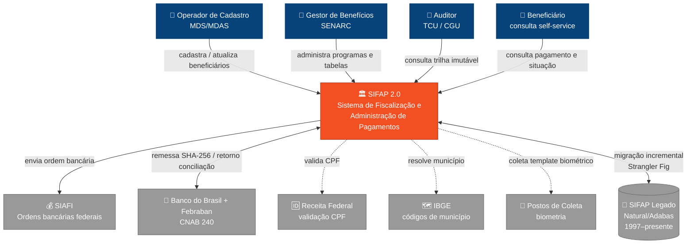
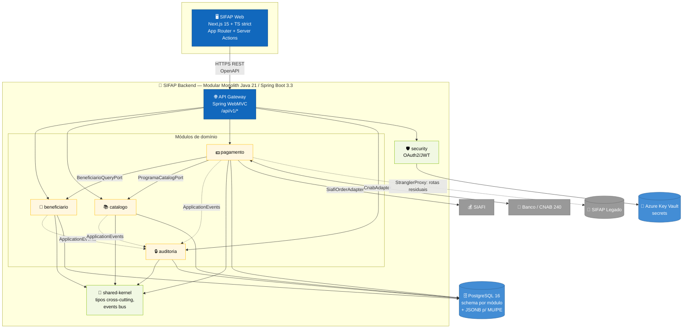

<!-- markdownlint-disable MD013 MD025 MD033 MD040 -->

# C4 Model — SIFAP 2.0

> Par 2 · Arquitetura · Estágio 2
> EA (L1: contexto + integrações externas) · SA (L2: containers internos)
> Notação: [C4 Model](https://c4model.com/)

---

## Nível 1 — Contexto do Sistema (EA)



### Atores (4) e por quê

| Ator | Origem no legado | Operação principal |
|---|---|---|
| Operador de Cadastro | `USR-INCLUSAO` em todas as DDMs | CRUD de Beneficiário |
| Gestor de Benefícios (SENARC) | nota em [`PROGRAMA-SOCIAL.ddm` linha 11](../01-arqueologia/legado-sifap/adabas-ddms/PROGRAMA-SOCIAL.ddm) | Atualiza Catálogo, fator-K, reajustes |
| Auditor (TCU/CGU) | obrigatoriedade IN-TCU 63/2010 ([`AUDITORIA.ddm` linha 9](../01-arqueologia/legado-sifap/adabas-ddms/AUDITORIA.ddm)) | Consulta trilha imutável |
| Beneficiário | Greenfield 2.0 | Self-service (canal novo — não existia no legado) |

### Sistemas externos (6)

| Sistema | Protocolo | Criticidade | Comprovação |
|---|---|---|---|
| SIAFI | síncrono REST + ordem bancária federal | **Crítico**: sem isso, dinheiro não sai | `PAGAMENTO.FA-FE` (campos `NUM-OB-SIAFI`, `NUM-NE-SIAFI`, `SIT-INTEG-SIAFI`) |
| Banco do Brasil + Febraban | assíncrono CNAB 240, remessa + retorno | **Crítico** | `PAGAMENTO.GA-GE` (conciliação) + `HA/HB` (hashes SHA-256) |
| Receita Federal | síncrono REST, opcional | Médio (CPF já vem do cadastro) | implícito em `BENEFICIARIO.AB` (DE) |
| IBGE | tabela estática | Baixo | `BENEFICIARIO.BI` (`COD-IBGE`) |
| Postos de Coleta Biométrica | assíncrono, batch | Baixo (opcional por programa) | `BENEFICIARIO.FA-FD` (adicionado 2005) |
| SIFAP Legado | coexistência via Strangler Fig | **Crítico durante migração** | ver [ADR-003](ADRs/ADR-003-strangler-coexistencia-siafi.md) |

---

## Nível 2 — Containers internos (SA)



### Convenções de implementação

| Aspecto | Decisão | Por quê |
|---|---|---|
| Unidade implantável | **Uma** (single JAR Spring Boot) | Modular Monolith (ver [ADR-001](ADRs/ADR-001-monolito-modular.md)). Evita complexidade distribuída em workshop de 8h. |
| Estrutura Maven | multi-module: `sifap-app`, `sifap-beneficiario`, `sifap-catalogo`, `sifap-pagamento`, `sifap-auditoria`, `sifap-shared-kernel` | Garante fronteira física entre contextos (build falha se módulo importar interno de outro) |
| Comunicação cross-module | Interfaces no `shared-kernel` + `@Service` no módulo dono | Sem REST interno, sem mensageria interna — chamada in-process |
| Eventos | Spring `ApplicationEventPublisher` (síncrono por padrão; `@Async` quando seguro) | Auditoria nunca bloqueia transação de negócio |
| Persistência | Schema PostgreSQL por módulo (`beneficiario.*`, `pagamento.*`, etc.); um único `DataSource` | Isolamento lógico hoje, fácil split físico amanhã |
| Estruturas Adabas MU/PE | Colunas `JSONB` + entidade JPA simplificada | Ver [ADR-002](ADRs/ADR-002-mapeamento-adabas-postgresql.md) |
| AuthN/Z | OAuth2/JWT centralizado, RBAC por perfil (`ADM/OPR/CON/AUD/SUP` — herdado de `AUDITORIA.EC`) | Compatível com perfis legados; Managed Identity para Azure-to-Azure |

---

## Nível 3 — Componentes do módulo `pagamento` (esboço)

```mermaid
flowchart TB
    classDef api fill:#85BBF0,stroke:#5D82A8,color:#0A0A0A
    classDef svc fill:#1168BD,stroke:#0B4884,color:#FFFFFF
    classDef repo fill:#438DD5,stroke:#2E6295,color:#FFFFFF
    classDef adapter fill:#999999,stroke:#6B6B6B,color:#FFFFFF
    classDef port fill:#F1F8E3,stroke:#7FBA00,color:#0A0A0A

    REST[PagamentoController<br/>REST /api/v1/pagamentos]:::api
    BATCH[CicloMensalScheduler<br/>@Scheduled — 1º dia útil]:::api

    CALC[CalculoBeneficioService<br/>fórmula central]:::svc
    DSCT[CalculoDescontoService<br/>teto 30% / judicial sem teto]:::svc
    CICLO[GeracaoCicloService<br/>idempotência por CPF+competência]:::svc
    CONC[ConciliacaoService<br/>retorno CNAB]:::svc

    REPO[PagamentoRepository<br/>Spring Data JPA]:::repo

    BQP[(BeneficiarioQueryPort)]:::port
    PCP[(ProgramaCatalogPort)]:::port

    SIAFI[SiafiOrderAdapter]:::adapter
    REMESSA[CnabRemessaAdapter]:::adapter
    RETORNO[CnabRetornoAdapter]:::adapter

    REST --> CALC & DSCT & CONC
    BATCH --> CICLO
    CICLO --> CALC --> DSCT --> REPO
    CICLO --> SIAFI --> REMESSA
    RETORNO --> CONC --> REPO

    CALC --> BQP
    CALC --> PCP
    CICLO --> BQP
```

### Por que essa decomposição

- `CalculoBeneficioService` espelha a fórmula de [`CALCBENF.NSN`](../01-arqueologia/legado-sifap/natural-programs/CALCBENF.NSN) (`VLR = BASE × FATOR_REG × FATOR_FAM × FATOR_RND × FATOR_IDADE`) mas com tabelas em PostgreSQL — não hardcoded como nas linhas 80–110 do legado.
- `CalculoDescontoService` separa o teto 30% e a exceção judicial (`tipo = 'J'`) que estão em [`CALCDSCT.NSN` linha 162](../01-arqueologia/legado-sifap/natural-programs/CALCDSCT.NSN).
- `GeracaoCicloService` garante idempotência por `(CPF, competência)` — regra atual de [`BATCHPGT.NSN` linhas 198–207](../01-arqueologia/legado-sifap/natural-programs/BATCHPGT.NSN) (`FIND PAGAMENTO-V WITH CPF-BENEF ... IF COMPETENCIA = ... MOVE TRUE TO #JA-GERADO`).
- Ordenação por CPF na geração é **contrato downstream** ([`BATCHPGT.NSN` linha 179](../01-arqueologia/legado-sifap/natural-programs/BATCHPGT.NSN)) — preservada como `ORDER BY cpf` na query JPA.

---

**Próximos artefatos:** [ADR-001](ADRs/ADR-001-monolito-modular.md), [ADR-002](ADRs/ADR-002-mapeamento-adabas-postgresql.md), [ADR-003](ADRs/ADR-003-strangler-coexistencia-siafi.md), [SPECIFICATION.md](SPECIFICATION.md).
