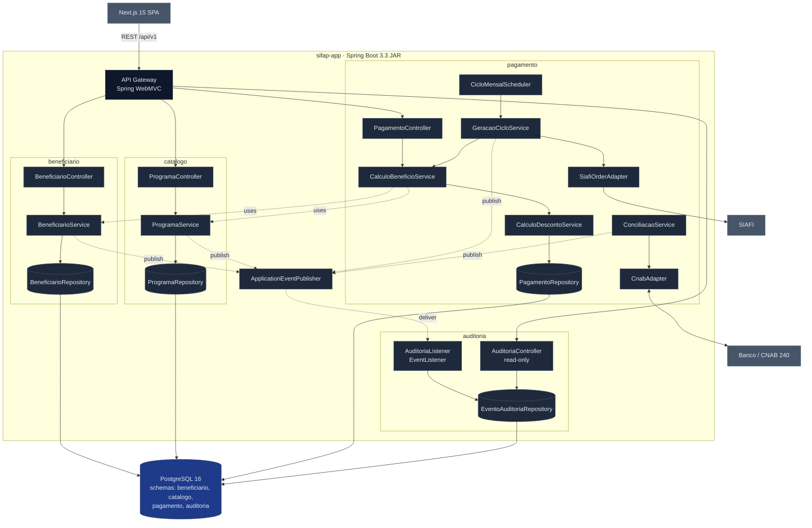

<!-- markdownlint-disable MD013 MD025 MD040 MD033 -->

# Design do Modular Monolith — SIFAP 2.0

> Par 2 · Arquitetura · Estágio 2 · Entrada do prompt `/design-modular-monolith`
> Blueprint para o Par 3 (`@builder-agent`) gerar código.

## Estrutura de Packages

Base package: **`br.gov.mds.sifap`** (alinhado ao owner do legado MDS/MDAS).

```text
br.gov.mds.sifap/
├── app/                              # Composition root
│   └── SifapApplication.java         # @SpringBootApplication
│
├── beneficiario/                     # Bounded Context 1
│   ├── api/                          # REST controllers (público)
│   │   └── BeneficiarioController.java
│   ├── api/dto/                      # DTOs request/response
│   ├── domain/                       # Entidades, VOs (interno)
│   │   ├── Beneficiario.java         # Aggregate root
│   │   ├── Dependente.java           # Entity dentro do aggregate
│   │   └── SituacaoBeneficiario.java # Enum A/S/C/I/D
│   ├── service/                      # Regras (interno)
│   │   └── BeneficiarioService.java
│   ├── repository/                   # JPA (interno)
│   │   └── BeneficiarioRepository.java
│   └── BeneficiarioModule.java       # @Configuration que exporta interface
│
├── catalogo/                         # Bounded Context 2
│   ├── api/
│   ├── domain/                       # ProgramaSocial, FaixaCalculo, ParametroRegional
│   ├── service/
│   └── repository/
│
├── pagamento/                        # Bounded Context 3
│   ├── api/
│   ├── domain/                       # Pagamento, Desconto, CicloMensal
│   ├── service/
│   │   ├── CalculoBeneficioService.java
│   │   ├── CalculoDescontoService.java
│   │   ├── GeracaoCicloService.java
│   │   └── ConciliacaoService.java
│   ├── repository/
│   ├── integracao/                   # Adapters externos (interno)
│   │   ├── siafi/SiafiOrderAdapter.java
│   │   ├── cnab/CnabRemessaAdapter.java
│   │   └── cnab/CnabRetornoAdapter.java
│   └── batch/                        # Spring Batch jobs
│       └── CicloMensalScheduler.java
│
├── auditoria/                        # Bounded Context 4
│   ├── api/                          # apenas read endpoints
│   ├── domain/                       # EventoAuditoria (imutável)
│   ├── service/                      # AuditoriaListener (@EventListener)
│   └── repository/
│
└── shared/                           # Cross-cutting
    ├── kernel/                       # Tipos comuns (Cpf, ValorMonetario, AnoMesRef)
    ├── ports/                        # Interfaces que módulos exportam/importam
    │   ├── BeneficiarioQueryPort.java   # exportada por beneficiario, importada por pagamento
    │   └── ProgramaCatalogPort.java     # exportada por catalogo, importada por pagamento
    ├── events/                       # Domain events (interfaces marcadoras)
    └── exception/                    # Exceções de domínio
```

**Regra de visibilidade Maven** (validável com [ArchUnit](https://www.archunit.org/)):

- Pacotes `*.domain`, `*.service`, `*.repository`, `*.integracao` são **internos** ao seu módulo — nenhum outro módulo pode importá-los.
- Apenas `*.api.dto` e `shared.ports.*` cruzam fronteiras de módulo.

## Interfaces de Módulo

### `BeneficiarioQueryPort` (exportada por `beneficiario`, importada por `pagamento`)

```java
package br.gov.mds.sifap.shared.ports;

public interface BeneficiarioQueryPort {

    Optional<BeneficiarioSnapshot> buscarPorCpf(Cpf cpf);

    List<BeneficiarioSnapshot> listarAtivosOrdenadosPorCpf();   // contrato REQ-PAY-13

    boolean estaAtivo(Cpf cpf);                                  // regra REQ-BEN-02

    record BeneficiarioSnapshot(
        Cpf cpf,
        String nomeCompleto,
        LocalDate dataNascimento,
        SituacaoBeneficiario situacao,
        String codPrograma,
        BigDecimal rendaFamiliar,
        int qtdDependentesAtivos,
        String codRegiao,
        String uf,
        List<DescontoCadastrado> descontosVigentes
    ) {}

    record DescontoCadastrado(
        TipoDesconto tipo,
        BigDecimal valor,
        BigDecimal percentual,
        LocalDate dtInicio,
        Optional<LocalDate> dtFim,
        Optional<String> numProcesso
    ) {}
}
```

### `ProgramaCatalogPort` (exportada por `catalogo`, importada por `pagamento`)

```java
public interface ProgramaCatalogPort {

    Optional<ProgramaSnapshot> buscarPorCodigo(String codPrograma);

    Optional<FatorRegional> buscarFatorRegional(String codPrograma, String codRegiao);

    record ProgramaSnapshot(
        String codigo,
        String sigla,
        TipoPrograma tipo,                  // A / T / P
        SituacaoPrograma situacao,          // A / I / E
        BigDecimal vlrBaseIndividual,
        BigDecimal vlrBaseFamiliar,
        BigDecimal vlrTeto,
        BigDecimal vlrPiso,
        BigDecimal pctReajusteAnual,
        BigDecimal rendaMaxPercap,
        Integer idadeMin,
        Integer idadeMax,
        boolean exigeDocumentos,
        boolean exigeBiometria,
        List<FaixaCalculo> faixasRenda
        // NOTA: FATOR-K NÃO entra no snapshot consumido por PagamentoService porque
        // VLR-BASE já vem ajustado por ele (BR-019). Aplicar FATOR-K aqui causaria
        // triplo reajuste. Cálculo do FATOR-K vive em CatalogoProgramasService no cadastro.
        // Ver BR-018/019, REQ-CAT-03, ADR-002 § 5, e MYS-011 (suspeita de duplo reajuste).
    ) {}

    record FaixaCalculo(BigDecimal rendaInicio, BigDecimal rendaFim,
                        BigDecimal fatorMultiplicador, BigDecimal vlrAdicional) {}

    record FatorRegional(String codRegiao, BigDecimal fator, BigDecimal complementoFixo) {}
}
```

### Interface pública de `pagamento` (exportada — chamada por `api.PagamentoController` e por scheduler)

```java
public interface PagamentoService {
    Pagamento calcularEArmazenar(Cpf cpf, AnoMesRef competencia);
    CicloMensalResultado executarCicloMensal(AnoMesRef competencia);
    void confirmarPagamento(NumPagamento num, DadosConfirmacaoBanco dados);
    void cancelar(NumPagamento num, MotivoCancelamento motivo);   // REQ-PAY-16
}
```

### Interface pública de `auditoria` (somente para queries)

```java
public interface AuditoriaQueryService {
    Page<EventoAuditoria> consultar(FiltroAuditoria filtro, Pageable page);
    // NOTA: nenhum método de escrita — eventos só entram via @EventListener
}
```

## Comunicação Cross-Context

**Padrão escolhido para o workshop: misto**

| Direção | Mecanismo | Por quê |
|---|---|---|
| `pagamento` → `beneficiario` | **Interface direta** (`BeneficiarioQueryPort`) | Síncrono no hot path do cálculo; latência mínima exigida; consistência forte |
| `pagamento` → `catalogo` | **Interface direta** (`ProgramaCatalogPort`) | Mesma razão; tabela cacheada (45 registros) |
| `beneficiario` → `catalogo` | **Interface direta** | Validação na inscrição |
| `*` → `auditoria` | **Domain events** (Spring `ApplicationEventPublisher`) | Auditoria nunca bloqueia transação; `@Async` quando seguro; consumer não pode quebrar publisher |

**Eventos publicados:**

```java
// br.gov.mds.sifap.shared.events
public sealed interface DomainEvent permits
    BeneficiarioCadastrado,
    SituacaoBeneficiarioAlterada,
    DependenteIncluido,
    ProgramaAtualizado,
    PagamentoGerado,
    PagamentoConfirmado,
    PagamentoDevolvido,
    PagamentoCancelado,
    CicloMensalConcluido { }
```

Cada evento carrega: `eventId (UUID)`, `ocorridoEm (Instant)`, `usuario (String)`, `ipOrigem (String)`, `correlationId (UUID)` — os 4 últimos vêm do `RequestContext` (interceptor que extrai do JWT/MDC), atendendo REQ-AUD-04.

## Endpoints por Bounded Context

| Contexto | Method | Path | Resumo | REQ |
|---|---|---|---|---|
| beneficiario | `POST` | `/api/v1/beneficiarios` | Cadastrar novo beneficiário | REQ-BEN-01, BEN-03, BEN-04 |
| beneficiario | `GET` | `/api/v1/beneficiarios/{cpf}` | Consultar beneficiário | REQ-BEN-01 |
| beneficiario | `PATCH` | `/api/v1/beneficiarios/{cpf}/situacao` | Alterar situação (A/S/C/I/D) | REQ-BEN-02 |
| beneficiario | `POST` | `/api/v1/beneficiarios/{cpf}/dependentes` | Incluir dependente | REQ-BEN-03 |
| beneficiario | `POST` | `/api/v1/beneficiarios/{cpf}/biometria` | Registrar coleta biométrica | REQ-BEN-05 |
| catalogo | `GET` | `/api/v1/programas` | Listar programas | REQ-CAT-01 |
| catalogo | `GET` | `/api/v1/programas/{codigo}` | Detalhar programa | REQ-CAT-01, CAT-02 |
| catalogo | `POST` | `/api/v1/programas/{codigo}/elegibilidade/{cpf}` | Avaliar elegibilidade | REQ-CAT-04..07 |
| pagamento | `POST` | `/api/v1/pagamentos:calcular` | Calcular e armazenar pagamento individual | REQ-PAY-01..07 |
| pagamento | `POST` | `/api/v1/pagamentos:ciclo-mensal` | Disparar ciclo mensal (admin) | REQ-PAY-12, PAY-13 |
| pagamento | `GET` | `/api/v1/pagamentos/{num}` | Consultar pagamento | REQ-PAY-16 |
| pagamento | `POST` | `/api/v1/pagamentos/{num}:cancelar` | Cancelar (válido em P/G) | REQ-PAY-16 |
| pagamento | `POST` | `/api/v1/conciliacao/cnab` | Processar arquivo CNAB 240 de retorno | REQ-PAY-15 |
| auditoria | `GET` | `/api/v1/auditoria` | Consultar trilha (filtros: período, ação, entidade, cpf) | REQ-AUD-01, AUD-05 |
| auditoria | `GET` | `/api/v1/auditoria/{id}` | Detalhar evento (antes/depois) | REQ-AUD-02 |

## Diagrama C4 Component



## ADRs Relacionados

| ADR | Afeta |
|---|---|
| [ADR-001](ADRs/ADR-001-monolito-modular.md) | Empacotamento único, estrutura de packages, comunicação in-process |
| [ADR-002](ADRs/ADR-002-mapeamento-adabas-postgresql.md) | Mapeamento JPA de `Beneficiario.dependentes`, `Pagamento.descontos`, `ProgramaSocial.faixasRenda` como `JSONB`; partição por `ano_mes_ref` |
| [ADR-003](ADRs/ADR-003-strangler-coexistencia-siafi.md) | Adicionar `StranglerProxy` no API Gateway antes dos controllers; feature flag `sifap.routing.<context>` |

## Definição de Pronto (validação)

- [x] Estrutura de packages 1:1 com bounded contexts
- [x] Cada contexto tem interface pública declarada (`*Port` no `shared.ports`)
- [x] Comunicação cross-context especificada (interface direta vs. eventos, com justificativa por par)
- [x] Diagrama Mermaid C4 component
- [x] Esqueleto OpenAPI: ver [openapi.yaml](openapi.yaml)
- [x] Design referencia ADRs e REQs

---

**Próximo handoff**: Par 3 (`@builder-agent`) gera código a partir deste design + [SPECIFICATION.md](SPECIFICATION.md) + [openapi.yaml](openapi.yaml).
