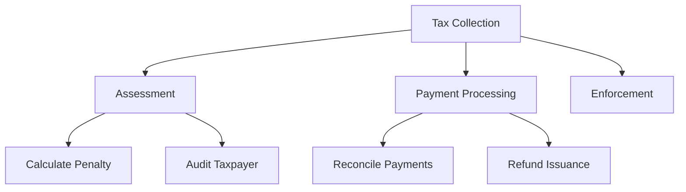

<!-- markdownlint-disable MD013 MD025 MD026 MD028 MD029 MD034 MD040 MD051 MD060 -->

---
name: Capability Map
description: 'Use ao mapear capacidades de negócio, identificar sobreposições ou lacunas na empresa, ou alinhar investimentos de TI a resultados de negócio. Aciona com "capability map", "business capability", "domain map", "enterprise architecture".'
---

# Mapa de Capacidades

## Quando invocar
- "Build a capability map for the payments domain."
- "Where do two teams overlap in ownership?"
- "Which capabilities are core, which are commodity?"

## Conceito

Uma **capability** é *o que* o negócio faz, não *como*. Capacidades são estáveis (escala de décadas); aplicações e processos são voláteis.

## Estrutura (3 níveis)
- **L1**: Área de negócio de nível superior (ex.: "Tax Collection", "Customer Service").
- **L2**: Subfunções principais (ex.: "Tax Assessment", "Payment Processing").
- **L3**: Capacidades específicas (ex.: "Calculate penalty interest", "Reconcile payments").

Regra prática: 8-12 capacidades L1 para uma empresa média.

## Passos
1. **Comece pelos resultados**, não pelo organograma. "What does this business do for its customers?"
2. **Decomponha de cima para baixo** até L3 (pare quando uma capacidade mapear para um único dono responsável).
3. **Marque cada capacidade**:
 - **Core**: diferencia, construir internamente.
 - **Supporting**: necessária, comprar ou configurar.
 - **Commodity**: indiferenciada, terceirizar ou usar SaaS.
4. **Sobreponha sistemas**: quais aplicações realizam cada capacidade L3. Procure:
 - Duplicidades (dois sistemas fazendo a mesma coisa)
 - Lacunas (capacidade sem dono)
 - Monólitos (um sistema cobrindo muitos L1s)
5. **Sobreponha investimento**: para onde o dinheiro está indo vs. onde está a diferenciação?

## Template de saída
```markdown
## Capability Map - <Domain>

### L1: <Top area>
#### L2: <Sub-function>
- **<L3 capability>** [Core|Supporting|Commodity]
 - Owner: <team>
 - Systems: <app1>, <app2>
 - Maturity: 1-5
 - Investment: $$$
```

## Exemplo Mermaid


## Gate de qualidade
Toda capacidade L3 deve ter exatamente um dono responsável e uma tag Core/Supporting/Commodity.
