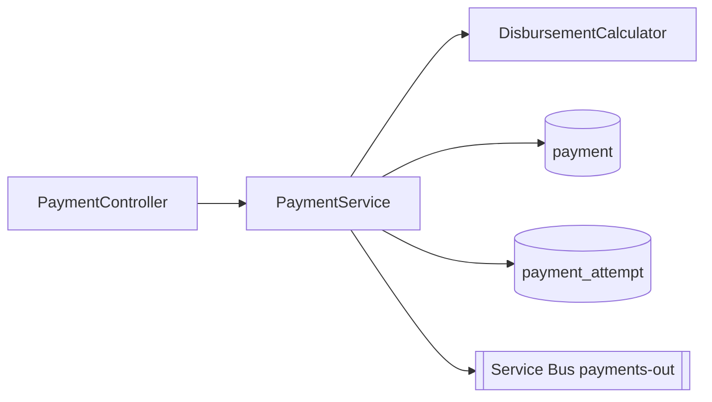

<!-- markdownlint-disable MD013 MD025 MD026 MD028 MD029 MD034 MD040 MD051 MD060 -->

---
mode: ask
model: claude-sonnet-4-6
description: "Produza um mapa de código navegável de um serviço SIFAP 2.0: componentes, dependências, cobertura de REQ-ID e pontos de integração."
---

# /codemap

## Objetivo

Você é o software architect gerando um **mapa de código em nível de serviço** que complementa `DESIGN.md`. Enquanto `DESIGN.md` responde "por quê", o code map responde "onde" e "o que toca o quê". Ele é lido na IDE, deve caber em dez minutos e é atualizado junto com qualquer mudança estrutural.

## Entradas

Peça ao usuário o que estiver faltando.

- O serviço a mapear (por exemplo `payments`, `beneficiaries`, `audit`).
- A raiz do path (`04-prototipo-sifap-moderno/backend/src/main/java/br/gov/sifap/<service>/`).
- A pasta de spec vinculada (`specs/<NNN>-<feature>/SPECIFICATION.md`).
- Se deve incluir ou excluir paths `test/`.
- Um code map anterior para este serviço, se existir.

## Processo

1. **Liste pacotes e tipos principais.** Para Java, agrupe por `controller`, `service`, `domain`, `repository`, `infrastructure`, `config`. Para TypeScript, agrupe por `app/`, `components/`, `lib/`, `server/`.
2. **Capture o papel de cada componente em uma linha.** "Orchestrates disbursement workflow," "JPA mapping for payment_attempt," "REST adapter for /api/v1/payments."
3. **Mapeie dependências inbound e outbound.** Inbound: quem chama isto? Outbound: o que isto chama? Fique em dependências diretas; análise transitiva fica em `DESIGN.md`.
4. **Encontre tipos compartilhados e ports.** Interfaces em `domain/`, ports em `application/`, gateways em `infrastructure/`. Liste quais são contratos estáveis e quais são internos.
5. **Cruze referências de REQ-IDs.** Para cada método público ou componente, encontre anotações `@implements REQ-NNN`. Liste componentes sem requisito ("no REQ-ID found") para revisão.
6. **Encontre linhagem legada.** Observe quais programas Natural em `02-cenario-sifap-legado/natural-programs/` mapeiam para qual componente Java. Isso é essencial para a modernização do SIFAP.
7. **Exponha architecture smells.**
 - Classes de service chamando controllers (direção errada).
 - Domain dependendo de infrastructure (direção errada).
 - Componentes com > 5 deps outbound (god class).
 - Componentes sem deps inbound (dead code).
8. **Renderize como Mermaid + tabela.** Mermaid para leitura visual, tabela para facilidade de grep.

## Saída

Um documento Markdown `docs/codemap-<service>.md` com esta estrutura:

```markdown
# Mapa de código — payments

> Última revisão: 2026-04-29 — owner: @morgan — mapa em nível de serviço.

## 1. Diagrama de componentes (Mermaid)



## 2. Componentes

| Tipo | FQN | Papel | REQ-IDs | Entrada | Saída |
|------|-----|------|---------|---------|----------|
| controller | `br.gov.sifap.payments.PaymentController` | Adaptador REST | REQ-PAY-001..006 | (HTTP) | PaymentService |
| service | `br.gov.sifap.payments.PaymentService` | Orquestração | REQ-PAY-001..018 | PaymentController, RetryJob | DisbursementCalculator, PaymentRepository, PaymentAttemptRepository, PaymentsOutGateway, AuditLogger |
| domain | `br.gov.sifap.payments.DisbursementCalculator` | Cálculo puro, ICMS, isenções | REQ-PAY-008..011 | PaymentService | (nenhuma) |
| repository | `br.gov.sifap.payments.PaymentRepository` | Mapeamento JPA para `payment` | REQ-PAY-001 | PaymentService | (DB) |
| gateway | `br.gov.sifap.payments.PaymentsOutGateway` | Produtor de Service Bus | REQ-PAY-014..018 | PaymentService | (Service Bus) |

## 3. API pública

| Método | Path | Testado por |
|--------|------|-----------|
| POST | /api/v1/payments | PaymentControllerTest |
| GET | /api/v1/payments/{id} | PaymentControllerTest |
| POST | /api/v1/payments/{id}/retry | PaymentControllerTest |

## 4. Estado persistente
- `payment` (REQ-PAY-001) — veja `db/migration/V*__create_payment.sql`.
- `payment_attempt` (REQ-PAY-014) — auditoria append-only de novas tentativas.
- `disbursement_lock` — advisory lock para evitar desembolso duplicado.

## 5. Linhagem legada
| Componente Java | Substitui |
|----------------|----------|
| DisbursementCalculator | `CALCBENF.NSN`, `CALCDSCT.NSN` |
| RetryJob | `BATCHPGT.NSN` |

## 6. Smells observados
- `PaymentService` tem 6 dependências de saída — quase uma god class. Candidata a extrair um `RetryOrchestrator`.
- Sem `@implements REQ-NNN` em `PaymentsOutGateway.send()` — atribua ou documente o motivo.

## 7. Como atualizar
Rode `/codemap` após qualquer adição/renomeação/exclusão em `payments/`. Vincule este arquivo a partir de `docs/CODEMAP.md`.
```

## Exemplo trabalhado

**Entrada:** Mapear o serviço `payments` depois que `RetryOrchestrator` foi extraído de `PaymentService`.

**Resposta esperada:** a estrutura acima, com o novo componente, contagem outbound atualizada para `PaymentService` (5 → 4), e uma nota resolvendo o smell sinalizado anteriormente.

## Antipadrões

- Autogerar a partir de imports. O mapa é curado; imports mentem sobre intenção.
- Listar toda classe. Mapeie componentes, não classes; agrupe os pequenos.
- Pular o diagrama Mermaid. Visuais capturam camadas quebradas instantaneamente.
- Sem coluna REQ-ID. Codemap sem rastreabilidade é listagem de diretório.
- Listar deps transitivas. Apenas diretas — mantenha escaneável.
- Pular linhagem legada para módulos SIFAP. O projeto inteiro depende disso.
- Deixar drift > 30 dias. Codemaps obsoletos confundem pessoas novas.

## Critérios de sucesso

- [ ] Diagrama Mermaid renderiza corretamente.
- [ ] Tabela cobre todos os componentes na pasta do serviço.
- [ ] Coluna REQ-ID preenchida; entradas ausentes explicitamente anotadas.
- [ ] Deps inbound/outbound são apenas diretas.
- [ ] Estado persistente lista tabelas e filas com vínculo a REQ-ID.
- [ ] Linhagem legada nomeia os programas Natural.
- [ ] Smells anotados incluem classes quase god class e anotações REQ-ID ausentes.
- [ ] Documento vinculado a partir de `docs/CODEMAP.md`.
