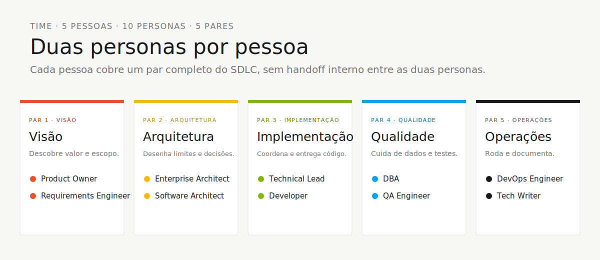
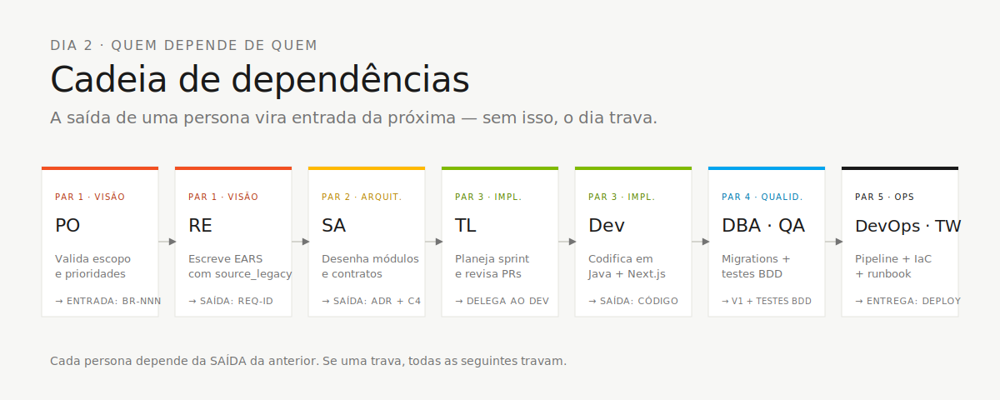

<!-- markdownlint-disable MD013 MD025 MD026 MD028 MD029 MD034 MD040 MD051 MD060 -->

# OVERVIEW das 10 Personas — Em Uma Página

 

> 🗺 **Você está aqui:** [Kit PT-BR](../README.md) → [Personas](README.md) → **OVERVIEW**

> **Para quem é isto?** Para escolher seu par sem precisar abrir 10 PERSONA.md, ou comparar papéis rapidamente.
>
> **O que você terá ao final desta leitura:**
>
> 1. Os 5 pares em uma página com a distribuição visual
> 2. Quem lidera cada estágio e quem apoia
> 3. Default de emergência de cada uma das 10 personas
> 4. Critério para escolher seu par com base no perfil

> **Use esta página para:** comparar os 10 papéis sem precisar abrir 10 `PERSONA.md`, escolher seu par com a pessoa-dupla, ou consultar rapidamente quem lidera o quê.
>
> Cada pessoa do time veste **2 personas** (1 par). O par fica junto o dia inteiro — sem passagem interna entre as duas personas.

## Os 5 pares (mapa visual)

## Tabela completa das 10 personas

| # | Persona | Par | Lidera estágio | Apoia em | Ferramenta principal | Default se travar |
|---|---|---|---|---|---|---|
| 01 | [Product Owner](01-product-owner/PERSONA.md) | 1 · Visão | 1 (priorização), 2 (sign-off de escopo) | 3, 4 | Copilot Ask + spec.prompt | "Temos 3h de código — escolham 3 features" |
| 02 | [Requirements Engineer](02-requirements-engineer/PERSONA.md) | 1 · Visão | 2 (EARS) | 1 | `/ears-convert` + Spec-Kit | Copia do `08-exemplos/SPECIFICATION-exemplo.md` |
| 03 | [Enterprise Architect](03-enterprise-architect/PERSONA.md) | 2 · Arquitetura | 2 (C4 + ADRs estruturais) | 4 | Mermaid + ADR template | Usa o ADR-001 do `08-exemplos/` |
| 04 | [Software Architect](04-software-architect/PERSONA.md) | 2 · Arquitetura | 2 (bounded contexts, módulos) | 3 | `/codemap` + impl-plan | Reusa monolito modular já decidido |
| 05 | [Technical Lead](05-technical-lead/PERSONA.md) | 3 · Implementação | 3 (padrões, revisão) | 4 (4), 2 | Plan mode + audit-context | Copia `PaymentService-exemplo.java` como template |
| 06 | [Developer](06-developer/PERSONA.md) | 3 · Implementação | 3 (código) | 4 | Plan mode + `/tdd` | Toca apenas 1 endpoint completo, com teste |
| 07 | [DBA](07-dba/PERSONA.md) | 4 · Qualidade | 3 (migrações Flyway) | 3 | `/migration` + query-audit | Copia `V1__init_payment_module-exemplo.sql` |
| 08 | [QA Engineer](08-qa-engineer/PERSONA.md) | 4 · Qualidade | 3 (testes BDD) | 3 | Test-strategy skill | Escreve 1 teste de aceitação por REQ-ID crítica |
| 09 | [DevOps Engineer](09-devops-engineer/PERSONA.md) | 5 · Operações | 4 (Terraform + CI/CD) | transversal | `/iac-module` + `/pipeline` | `terraform plan` apenas, nunca `apply` |
| 10 | [Tech Writer](10-tech-writer/PERSONA.md) | 5 · Operações | 4 (relatório do Agent) | transversal (1, 2, 3) | Markdown skills + Copilot Ask | Copia template em `08-exemplos/` |

## Quem lidera cada estágio

| Estágio | Horário | Lidera | Apoia |
|---|---|---|---|
| **1 · Arqueologia** | 11:00–12:00 + 13:30–14:00 | Todos os 5 pares em paralelo (cada um com 3 programas) | — |
| **2 · Spec Moderna** | 14:00–15:00 | Par 2 (EA + SA) | Par 1 (escopo), Par 5 (revisão) |
| **3 · Implementação** | 15:00–16:10 | Pares 3 (TL + Dev) e 4 (DBA + QA) | Par 5 (esqueleto CI) |
| **4 · Evolução** | 16:10–16:50 | Par 5 (DevOps + TW) | Par 3 (Issues + revisão de PRs do Agent) |

## Quem depende de quem (cadeia do dia)

## Como escolher seu par

| Se você é mais… | Considere o par |
|---|---|
| Pessoa de negócio / produto | **1 · Visão** (PO + RE) |
| Arquiteto / desenhista de sistemas | **2 · Arquitetura** (EA + SA) |
| Programador / dev sênior | **3 · Implementação** (TL + Dev) |
| Pessoa de dados / testes | **4 · Qualidade** (DBA + QA) |
| Pessoa de infra / documentação | **5 · Operações** (DevOps + TW) |

> **Não tem certeza?** Pares 1, 4 e 5 acomodam pessoas não-técnicas. Pares 2 e 3 pedem alguém com background técnico.

## Defaults de emergência (resumo)

Cada `PERSONA.md` tem uma seção "Se travar (defaults de emergência)". Aqui está o resumo de **uma linha** por persona:

- **PO:** *"Temos 3 horas de código; escolham 3 funcionalidades."*
- **RE:** Copie de `08-exemplos/SPECIFICATION-exemplo.md` e adapte.
- **EA:** Copie ADR-001 de `08-exemplos/` e troque a decisão.
- **SA:** Use o monolito modular já decidido — não invente.
- **TL:** Aborte refatoração sem teste; revise PRs do par.
- **Dev:** 1 endpoint completo > 5 quebrados. Testcontainers obrigatório.
- **DBA:** Use `V1__init_payment_module-exemplo.sql` como base. Nunca edite migration antiga.
- **QA:** 1 teste por REQ-ID crítica. Caminho feliz + caminho de erro.
- **DevOps:** `terraform plan` só. `apply` em workshop = ❌.
- **TW:** Pergunte ao par líder: *"O que você decidiu nos últimos 30 min que ainda não está escrito?"*
---

### Continuar a leitura

<table width="100%">
<tr>
<td width="50%" valign="top" align="left">
<strong>← ANTERIOR</strong> 
<a href="../00-SETUP.md"><strong>SETUP</strong></a> 
Setup do laptop: Git, VS Code, Copilot, Spec-Kit, branch protection.
</td>
<td width="50%" valign="top" align="right">
<strong>PRÓXIMO →</strong> 
<a href="../01-arqueologia/GUIDE.md"><strong>Estágio 1 — Arqueologia</strong></a> 
11:00–12:00 + 13:30–14:00 · Ler o legado e catalogar regras de negócio.
</td>
</tr>
</table>

↑ <a href="../README.md">Voltar ao Kit PT-BR</a>
