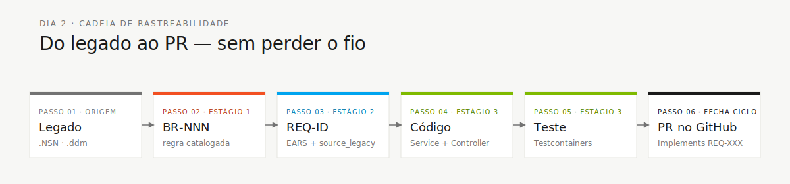

<!-- markdownlint-disable MD013 MD025 MD026 MD028 MD029 MD034 MD040 MD051 MD060 -->

# Glossário Visual — Jargão Decodificado

  

> 🗺 **Você está aqui:** [Kit PT-BR](../README.md) → [Conceitos](00-README.md) → **Glossário Visual**

> **Para quem é isto?** Para qualquer pessoa do time (especialmente PO, Tech Writer, analistas e quem não programa há um tempo) que vai cruzar com estes termos hoje. Cada verbete tem **três linhas só**: o que é, uma analogia do dia-a-dia, e onde aparece no workshop.
>
> **Como usar:** abra esta página em uma aba à parte e volte aqui sempre que tropeçar em uma sigla. Você não precisa decorar nada — só precisa saber onde olhar.

## Mapa rápido por estágio

| Você está no… | Vai cruzar com (mínimo) |
|---|---|
| Estágio 1 (Arqueologia) | Natural, NSN, DDM, Adabas, MU, PE, BR-NNN, glossário, mistério |
| Estágio 2 (Spec Moderna) | EARS, REQ-ID, source_legacy, ADR, C4, bounded context, greenfield, Spec-Kit |
| Estágio 3 (Implementação) | JPA, Flyway, migração, Testcontainers, controller, service, repository, Bean Validation, Server Component, Swagger |
| Estágio 4 (Evolução) | Agent, Issue, PR, Terraform, IaC, CI/CD, Actions, ACR, Key Vault |

---

## 🌍 Tabela de equivalência (EN ↔ PT-BR ↔ Super Mario)

Para quem precisa traduzir entre inglês técnico, português do workshop e a analogia Mario:

| 🇬🇧 Inglês | 🇧🇷 PT-BR | 🍄 Mario |
|---|---|---|
| handoff | passagem | cano verde 🟢 |
| stakeholder | parte interessada | NPC importante (Princesa, Toad) |
| backlog | lista de pendências | quests não aceitas ainda |
| commit | versão local | save rápido 💾 |
| push | enviar para nuvem | backup na nuvem ☁️ |
| pull request (PR) | proposta de mudança | mostrar save pros colegas 👀 |
| merge | unir branches | save oficial no servidor |
| rebase | reorganizar histórico | mudar a ordem dos saves |
| code review | revisão de código | colega olhando seu save |
| CI green | testes passaram | estrela de invencibilidade ⭐ |
| CI red | testes falharam | Goomba na cara 🟫 |
| breaking change | mudança incompatível | troca de mundo (1 → 2) |
| rollback | reverter | voltar para o checkpoint |
| feature flag | botão liga/desliga | bloco com `?` |
| deployment | publicar versão | conquistar o castelo 🏰 |
| production | ambiente real | jogo de verdade |
| staging | ambiente de teste | warp zone |
| sandbox | ambiente isolado | sala de treino |
| bug | defeito | Goomba no caminho |
| hotfix | correção urgente | cogumelo 1-up |
| refactor | reescrever sem mudar comportamento | reorganizar inventário |
| technical debt | dívida técnica | corações faltando |
| smoke test | teste de fumaça | "joga 1 nível para ver se ligou" |
| spike | investigação curta | explorar um cano novo |

---

## A

### ADR · Architecture Decision Record

- **O que é:** um arquivo curto em Markdown que registra **uma decisão de arquitetura** e por quê ela foi tomada.
- **Analogia:** ata de reunião curta, mas só sobre "por que escolhemos isso".
- **Onde aparece:** Estágio 2. Template em `02-spec-moderna/ADR-TEMPLATE.md`, exemplos em `08-exemplos/ADR-001-monolito-modular.md`.

### Adabas

- **O que é:** o banco de dados do mainframe onde o SIFAP guarda dados há 29 anos.
- **Analogia:** o "Excel gigante" do governo, mas com regras especiais (ver MU e PE).
- **Onde aparece:** Estágio 1, ao olhar os arquivos `.ddm` em `01-arqueologia/legado-sifap/adabas-ddms/`.

### Agent (Copilot Agent / modo Agent)

- **O que é:** terceiro modo do GitHub Copilot. Você escreve uma **Issue bem detalhada**, ele lê o código, implementa e abre um PR sozinho.
- **Analogia:** estagiário muito rápido e literal — faz exatamente o que você pediu, sem perguntar.
- **Onde aparece:** Estágio 4 (`04-evolucao/GUIDE.md`).

### Ask (modo Ask do Copilot)

- **O que é:** primeiro modo do Copilot. Você pergunta, ele responde no chat.
- **Analogia:** Google interno do seu código.
- **Onde aparece:** todos os estágios. Cheat-sheet: `09-cheat-sheets/copilot-3-modes.md`.

## B

### Bean Validation

- **O que é:** anotações Java (`@NotNull`, `@Email`, `@Size`) que validam dados de entrada automaticamente.
- **Analogia:** porteiro do prédio — barra os dados ruins antes deles entrarem.
- **Onde aparece:** Estágio 3, nos DTOs dos controllers.

### Bounded Context

- **O que é:** um pedaço bem delimitado do sistema com vocabulário próprio. Em SIFAP temos 4: `beneficiary`, `payment`, `audit`, `admin`.
- **Analogia:** departamentos de uma empresa — RH e Contabilidade têm a palavra "salário", mas significam coisas diferentes em cada um.
- **Onde aparece:** Estágios 2 e 3.

### BR-NNN · Business Rule (regra de negócio)

- **O que é:** identificador de uma regra extraída do legado (ex.: `BR-013`).
- **Analogia:** número da nota fiscal — sem ele, ninguém acha de novo.
- **Onde aparece:** Estágio 1, no `business-rules-catalog.md`.

## C

### C4 (modelo C4)

- **O que é:** forma de desenhar arquitetura em 4 níveis de zoom: **Contexto** (L1), **Containers** (L2), **Componentes** (L3) e **Código** (L4).
- **Analogia:** Google Maps do sistema — você pode ver o país, a cidade, o quarteirão ou a casa.
- **Onde aparece:** Estágio 2. Usamos apenas L1 e L2.

### CI/CD · Integração e Entrega Contínuas

- **O que é:** automação que roda testes a cada commit (CI) e faz deploy automático (CD).
- **Analogia:** linha de montagem que testa cada peça antes da próxima estação.
- **Onde aparece:** Estágio 4, em `.github/workflows/`.

### Controller

- **O que é:** a classe Java que recebe requisições HTTP (`POST /api/v1/payments`) e devolve respostas.
- **Analogia:** recepcionista — atende e encaminha para o setor certo.
- **Onde aparece:** Estágio 3, em `infrastructure/`.

## D

### DDM · Data Definition Module

- **O que é:** arquivo `.ddm` do Adabas que descreve a estrutura de uma "tabela" (campos, tipos, tamanhos).
- **Analogia:** o schema do Excel — quais colunas existem, de que tipo, com que tamanho.
- **Onde aparece:** Estágio 1, em `01-arqueologia/legado-sifap/adabas-ddms/`. Temos 4: BENEFICIARIO, PROGRAMA-SOCIAL, PAGAMENTO, AUDITORIA.

### DoD · Definition of Done

- **O que é:** lista de checkboxes que provam que uma etapa terminou de verdade.
- **Analogia:** checklist do piloto antes de decolar.
- **Onde aparece:** final de cada `GUIDE.md`.

### DTO · Data Transfer Object

- **O que é:** um "saco" com campos para enviar/receber dados pela API. Sem regras, só dados.
- **Analogia:** envelope com formulário preenchido.
- **Onde aparece:** Estágio 3 (`PaymentRequest.java`, `BeneficiaryResponse.java`).

## E

### EARS · Easy Approach to Requirements Syntax

- **O que é:** forma padrão de escrever requisitos sem ambiguidade, usando 6 padrões (sempre, evento, estado, opcional, proibido, combinado).
- **Analogia:** receita de bolo — tem ingrediente, ordem e tempo. Sem chute.
- **Onde aparece:** Estágio 2. Padrões detalhados em `02-spec-moderna/GUIDE.md§EARS`.
- **Exemplo bom:** *"Quando um beneficiário é cadastrado, o SIFAP deve validar o CPF usando módulo 11."*
- **Exemplo ruim:** *"O sistema deve ser seguro."* (não é testável)

## F

### Flyway

- **O que é:** ferramenta que aplica scripts SQL versionados no banco (`V1__init.sql`, `V2__add_status.sql`).
- **Analogia:** controle de versão do banco — você nunca edita uma migração antiga, sempre cria uma nova.
- **Onde aparece:** Estágio 3, em `src/main/resources/db/migration/`.

## G

### Greenfield

- **O que é:** requisito que **não vem do legado** — é funcionalidade nova de verdade.
- **Analogia:** terreno baldio para construir do zero.
- **Onde aparece:** Estágio 2. Quando uma REQ-ID é greenfield, escrevemos `source_legacy: "[GREENFIELD] <motivo>"`.

## I

### IaC · Infrastructure as Code

- **O que é:** descrever servidores, bancos e redes em arquivos de texto (Terraform) em vez de criar tudo na mão no portal Azure.
- **Analogia:** receita do bolo da infraestrutura — qualquer pessoa pode refazer o mesmo bolo.
- **Onde aparece:** Estágio 4, em `05-terraform-azure/`.

### Issue (GitHub Issue)

- **O que é:** um ticket no GitHub descrevendo o que precisa ser feito.
- **Analogia:** post-it gigante anexado ao código.
- **Onde aparece:** Estágio 4 — você escreve Issues que o Agent vai implementar.

## J

### JPA · Java Persistence API

- **O que é:** padrão Java para mapear classes em tabelas do banco. Você marca a classe com `@Entity` e o banco entende.
- **Analogia:** tradutor entre o mundo de objetos do Java e o mundo de tabelas do PostgreSQL.
- **Onde aparece:** Estágio 3 (`@Entity public class PaymentEntity { ... }`).

### JWT · JSON Web Token

- **O que é:** "passe" criptografado que o backend dá ao usuário após login. Você envia em cada requisição.
- **Analogia:** pulseirinha de festa — provou quem é uma vez, agora basta mostrar a pulseira.
- **Onde aparece:** Estágio 3, na autenticação via Swagger.

## M

### Migração (database migration)

- **O que é:** script SQL versionado que muda o schema do banco (criar tabela, adicionar coluna).
- **Onde aparece:** Estágio 3, gerenciado pelo Flyway.

### MU · Multiple-Value field (Adabas)

- **O que é:** campo do Adabas que guarda **vários valores** dentro de uma mesma linha (ex.: `TELEFONES` com 3 números).
- **Analogia:** célula do Excel com lista dentro — coisa que SQL puro não tem.
- **Por que importa:** todo `MU` no DDM vira uma **tabela filha** no PostgreSQL (ex.: `beneficiary_phone`).
- **Onde aparece:** Estágio 1, ao mapear os 4 DDMs.

## N

### Natural (linguagem)

- **O que é:** linguagem de programação dos anos 80 usada com Adabas no mainframe. Nossos arquivos `.NSN` são programas Natural.
- **Analogia:** parente distante do COBOL — verboso, com `IF`/`END-IF`, sem orientação a objeto.
- **Onde aparece:** Estágio 1. Guia de leitura para não-programadores: `01-arqueologia/legado-sifap/COMO-LER-NATURAL.md`.

### NSN (arquivo `.NSN`)

- **O que é:** extensão dos programas Natural.
- **Analogia:** equivalente a `.py` (Python) ou `.java` (Java), mas para Natural.
- **Onde aparece:** Estágio 1, em `01-arqueologia/legado-sifap/natural-programs/` (temos 15).

## P

### PE · Periodic Group (Adabas)

- **O que é:** grupo de campos que se repete várias vezes dentro do mesmo registro (ex.: até 12 históricos mensais).
- **Analogia:** sub-tabela embutida na linha — também não cabe em SQL puro.
- **Por que importa:** todo `PE` vira tabela filha no PostgreSQL.
- **Onde aparece:** Estágio 1, junto com MU.

### PR · Pull Request

- **O que é:** pedido de incorporar mudanças de uma branch na branch principal (`main`).
- **Analogia:** pedir aprovação de um desenho antes de pintar a parede.
- **Onde aparece:** todos os estágios. Estágio 4: o Agent abre PRs sozinho.

### Plan (modo Plan do Copilot)

- **O que é:** segundo modo do Copilot. Você descreve uma mudança, ele propõe um **plano** com os arquivos a tocar — antes de fazer.
- **Analogia:** orçamento antes da reforma.
- **Onde aparece:** Estágios 2, 3, 4. Cheat-sheet: `09-cheat-sheets/copilot-3-modes.md`.

## R

### Repository (Spring Data)

- **O que é:** interface Java que dá métodos prontos pra ler/gravar dados (`findById`, `save`, `deleteAll`).
- **Analogia:** garçom — você pede `findById(42)` e ele traz da cozinha (banco).
- **Onde aparece:** Estágio 3, em `infrastructure/`.

### REQ-ID

- **O que é:** identificador único de um requisito (ex.: `REQ-PAY-013`).
- **Analogia:** número da CNH — sem ele, o requisito não rastreia.
- **Onde aparece:** Estágio 2 em diante. Todo commit do Estágio 3 cita `Implements REQ-XXX`.

## S

### Server Component (Next.js)

- **O que é:** componente React que **roda no servidor** — sem JavaScript no navegador do usuário.
- **Analogia:** página HTML clássica gerada no servidor, mas escrita em estilo React moderno.
- **Onde aparece:** Estágio 3, no frontend Next.js.

### Service

- **O que é:** classe Java com a **lógica de negócio**. Fica entre Controller e Repository.
- **Analogia:** cérebro da operação — recebe pedido do recepcionista (controller) e decide o que fazer.
- **Onde aparece:** Estágio 3, em `application/`.

### `source_legacy:`

- **O que é:** linha obrigatória em cada REQ-ID que aponta para o arquivo legado de origem (ex.: `01-arqueologia/legado-sifap/natural-programs/CALCDSCT.NSN#L142-L148`).
- **Analogia:** nota de rodapé com fonte da informação.
- **Onde aparece:** Estágio 2. **Se faltar, o CI rejeita o PR.**

### Spec-Kit

- **O que é:** ferramenta oficial do GitHub para Spec-Driven Development. Instala comandos `/speckit.specify`, `/speckit.clarify`, `/speckit.plan`, etc.
- **Analogia:** roteiro guiado — do "tenho uma ideia" até "tenho tarefas claras".
- **Onde aparece:** Estágio 2. Cheat-sheet: `09-cheat-sheets/spec-kit-workflow.md`.

### Swagger UI

- **O que é:** página web automática que documenta e testa endpoints da API.
- **Analogia:** menu interativo do restaurante — você lê o cardápio e pede direto na página.
- **Onde aparece:** Estágio 3, em `http://localhost:8080/swagger-ui.html`.

## T

### Terraform

- **O que é:** ferramenta de IaC que descreve infraestrutura Azure em arquivos `.tf`.
- **Analogia:** receita escrita da nuvem — `terraform apply` cria tudo.
- **Onde aparece:** Estágio 4, em `05-terraform-azure/`. **No workshop só rodamos `terraform plan` — nada de `apply` real.**

### Testcontainers

- **O que é:** biblioteca Java que sobe um **PostgreSQL real em Docker** durante os testes — não usa mock.
- **Analogia:** simulador de voo real, não videogame.
- **Onde aparece:** Estágio 3. Exige Docker rodando.

## V

### `.NSN`

→ ver **NSN**.

---

## Atalhos visuais

Essa cadeia é a **rastreabilidade** que o CI verifica. Sempre que tiver dúvida do que está fazendo, volte ao elo anterior.

---

### Continuar a leitura

<table width="100%">
<tr>
<td width="50%" valign="top" align="left">
<strong>← ANTERIOR</strong> 
<a href="README.md"><strong>Documentação transversal</strong></a> 
glossário, sdlc-flow, persona-agent-matrix, runbook.
</td>
<td width="50%" valign="top" align="right">
<strong>PRÓXIMO →</strong> 
<a href="../01-arqueologia/legado-sifap/COMO-LER-NATURAL.md"><strong>Como Ler Natural</strong></a> 
Extrair regras de .NSN sem saber a sintaxe.
</td>
</tr>
</table>

↑ <a href="../README.md">Voltar ao Kit PT-BR</a>
