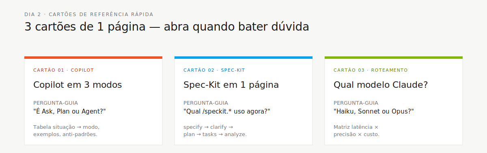

<!-- markdownlint-disable MD013 MD025 MD026 MD028 MD029 MD034 MD040 MD051 MD060 -->

# Cartões de Referência

 

> 🗺 **Você está aqui:** [Kit PT-BR](../README.md) → **Cheat-sheets**

> **Para quem é isto?** Quem precisa de resposta rápida sem ler um guia completo.
>
> **O que você terá ao final desta leitura:**
>
> 1. Saber qual cartão consultar para cada dúvida
> 2. Tabela com 3 cartões: Copilot, Spec-Kit, Roteamento de modelos
> 3. Quando bate a dúvida, em qual cartão olhar

> Cartões de uma página para impressão, desenhados para ficar na mesa de cada time.

## Quando usar isso

Você abre um cartão de referência quando precisa de **resposta rápida** sem ler um guia completo. Cada um responde uma pergunta específica:

## Conteúdo

| Arquivo                                    | Tópico                                          | Use quando                                           |
| ------------------------------------------ | ----------------------------------------------- | ---------------------------------------------------- |
| [`copilot-3-modes.md`](copilot-3-modes.md) | GitHub Copilot: modos Ask, Plan e Agent         | Estiver na dúvida sobre qual modo do Copilot acionar |
| [`spec-kit-workflow.md`](spec-kit-workflow.md) | Fluxo Spec-Kit de relance                       | Não souber qual comando `/speckit.*` usar            |
| [`model-routing.md`](model-routing.md)     | Qual modelo de IA usar para cada tipo de tarefa | Estiver decidindo entre Haiku, Sonnet ou Opus        |
---

### Continuar a leitura

<table width="100%">
<tr>
<td width="50%" valign="top" align="left">
<strong>← ANTERIOR</strong> 
<a href="../05-personas/README.md"><strong>Persona Kits — Índice</strong></a> 
10 PERSONA.md com agentes, prompts, skills e MCP por papel.
</td>
<td width="50%" valign="top" align="right">
<strong>PRÓXIMO →</strong> 
<a href="copilot-3-modes.md"><strong>Copilot em 3 modos</strong></a> 
Quando usar Ask, Plan ou Agent — tabela situação → modo.
</td>
</tr>
</table>

↑ <a href="../README.md">Voltar ao Kit PT-BR</a>

— Paula
