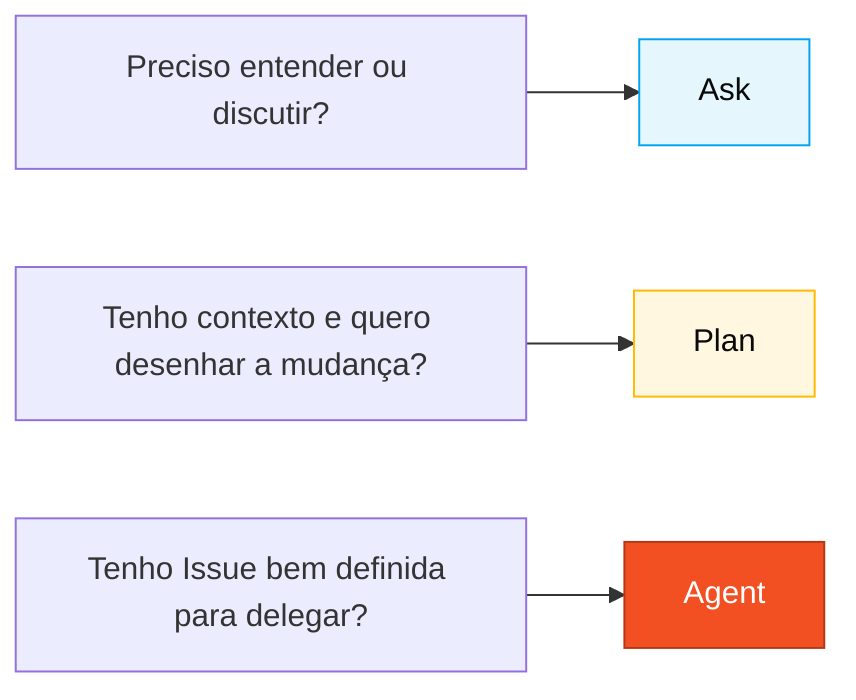

<!-- markdownlint-disable MD013 MD025 MD026 MD028 MD029 MD034 MD040 MD051 MD060 -->

# GitHub Copilot em 3 modos — Cartão de referência

> 🗺 **Você está aqui:** [Kit PT-BR](../README.md) → [Cheat-sheets](README.md) → **Copilot 3 modos**

> **Para quem é isto?** Quem está com dúvida sobre qual modo do Copilot acionar agora.
>
> **O que você terá ao final desta leitura:**
>
> 1. Saberá quando usar Ask (perguntar), Plan (planejar) ou Agent (delegar)
> 2. Verá exemplos concretos de cada modo no contexto SIFAP
> 3. Identificará anti-padrões para cada modo

  

## Quando usar isso

Sempre que você for abrir o Copilot, pergunte primeiro: **Ask, Plan ou Agent?** O modo certo economiza tempo. O modo errado custa horas.

## Decisão rápida

| Situação                                                 | Modo      | Por quê                                  |
| -------------------------------------------------------- | --------- | ---------------------------------------- |
| Entender código, discutir design, tirar dúvidas          | **Ask**   | Conversa, custo baixo, reversível        |
| Desenhar uma mudança antes de executar                   | **Plan**  | Plano explícito, escopo e arquivos claros |
| Delegar uma tarefa completa (issue → PR)                 | **Agent** | Trabalha sozinho, você revisa no final   |

## Visual

---

## Ask — Perguntar e explorar

**Use quando**: você ainda não sabe o que quer; quer entender; quer discutir; quer avaliar um trade-off.

**Frases que funcionam:**

- _"Explique o que este programa Natural faz linha por linha."_
- _"Quais riscos de usar `JSONB` para guardar histórico de contas bancárias?"_
- _"Resuma este DDM em 5 linhas para alguém que não conhece Adabas."_
- _"Desafie o seguinte ADR: `{cole o ADR}`."_

**Erros comuns:**

- Usar Ask para executar uma mudança multi-arquivo. Use Plan ou Agent.
- Aceitar resposta sem validar. Copilot alucina — sempre confira.
- Prompt curto demais ("ajuda"). Dê contexto: o que você tem, o que quer, o que já tentou.

---

## Plan — Planejar mudanças

**Use quando**: você sabe o que quer, precisa envolver vários arquivos e quer validar escopo, sequência e riscos antes de executar.

**Frases que funcionam:**

- _"Planeje a criação dos módulos `beneficiary`, `agreement`, `payment` com estrutura padrão de pacote Spring Boot."_
- _"Liste os testes necessários para cada método público de `PaymentService` antes de implementar."_
- _"Planeje o rename de `Convenio` para `Agreement` no projeto inteiro e a ordem segura das mudanças."_
- _"Revise as migrações Flyway existentes e proponha uma sequência para adicionar rollback documentado."_

**Erros comuns:**

- Escopo amplo demais. Quebre em etapas.
- Não revisar o plano. Ajuste antes de executar.
- Misturar mudanças de lógica com renames. Um PR por propósito.

---

## Agent — Delegação com autonomia

**Use quando**: você tem uma Issue bem descrita, aceita que vai demorar, e está disposto a revisar um PR gerado por alguém que não é você.

**Como preparar:**

1. Escreva a Issue com **contexto, critérios de aceitação e escopo**.
2. Aponte para os arquivos relevantes (_"leia `docs/adr/001.md` antes de começar"_).
3. Diga o que NÃO fazer (_"não altere o schema do PostgreSQL"_).

**Acompanhamento**: não opere enquanto o Agent estiver rodando. Deixe ir. Cheque a cada ~10 minutos se o caminho faz sentido.

**Revisar PR do Agent**: exatamente como revisaria PR humano. Revisão rápida continua sendo revisão.

**Erros comuns:**

- Issue vaga → Agent entrega lixo.
- Disparar Agent para tarefa de 5 minutos que Ask ou Plan resolveriam.
- Mergear sem revisar porque "foi o Agent".

---

## Exemplos visuais por persona

| Persona               | Modo principal               | Modo secundário                   |
| --------------------- | ---------------------------- | --------------------------------- |
| Product Owner         | Ask (refinar stories)        | Plan (priorizar escopo)           |
| Requirements Engineer | Ask (validar EARS)           | Plan (organizar requisitos)       |
| Software Architect    | Ask (decidir padrão)         | Plan (desenhar módulo)            |
| Developer             | Plan (mudanças multi-arquivo)| Ask, Agent                        |
| QA Engineer           | Plan (cobertura e cenários)  | Ask (discutir lacunas)            |
| DevOps                | Agent (cadeias longas de CI) | Plan (Terraform)                  |
| Tech Writer           | Ask (revisão de estilo)      | Plan (reestruturar ADR)           |

---

## Regra de bolso

> [!TIP]
> **Teste do espelho.** Se você não soubesse que era IA, aceitaria esse código no seu projeto? Se não, rejeite ou refine. O Copilot acelera quem sabe; não substitui julgamento.
---

### Continuar a leitura

<table width="100%">
<tr>
<td width="50%" valign="top" align="left">
<strong>← ANTERIOR</strong> 
<a href="README.md"><strong>Cartões de Referência</strong></a> 
3 cartões de 1 página: Copilot, Spec-Kit, modelos.
</td>
<td width="50%" valign="top" align="right">
<strong>PRÓXIMO →</strong> 
<a href="spec-kit-workflow.md"><strong>Spec-Kit em 1 página</strong></a> 
Sequência specify → clarify → plan → tasks → analyze.
</td>
</tr>
</table>

↑ <a href="../README.md">Voltar ao Kit PT-BR</a>

— Paula
