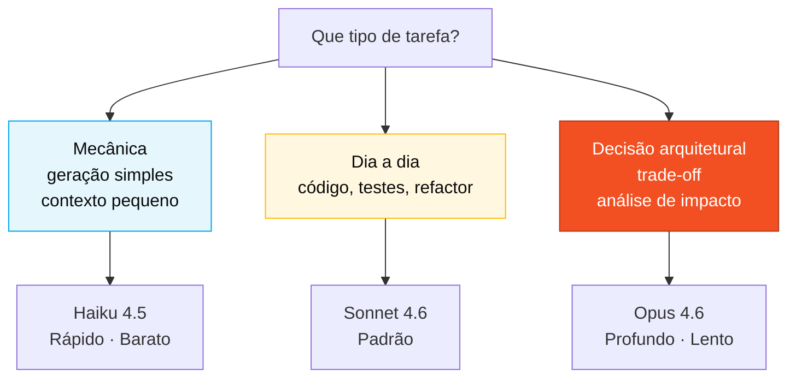

<!-- markdownlint-disable MD013 MD025 MD026 MD028 MD029 MD034 MD040 MD051 MD060 -->

# Roteamento de modelos Claude — Cartão de referência

> 🗺 **Você está aqui:** [Kit PT-BR](../README.md) → [Cheat-sheets](README.md) → **Model routing**

> **Para quem é isto?** Quem precisa decidir entre Haiku, Sonnet ou Opus para a próxima tarefa.
>
> **O que você terá ao final desta leitura:**
>
> 1. Matriz custo × latência × precisão dos 3 modelos
> 2. Recomendação por tipo de tarefa (revisão, escrita, decisão)
> 3. Tabela por persona com modelo default

  

## Quando usar isso

Antes de mandar um prompt grande para o Copilot, decida o modelo. **Trocar de modelo é menos custoso do que esperar 30 segundos pelo modelo errado.**

## Regra mestre

> Modelo maior = mais capaz e mais lento. Use o menor que resolve seu caso. Guarde o Opus para decisões, não para produção em lote.

## Visual

## Os três modelos

| Modelo         | Quando usar                                                      | Custo relativo | Velocidade |
| -------------- | ---------------------------------------------------------------- | -------------- | ---------- |
| **Haiku 4.5**  | Tarefa mecânica, transformação simples, contexto pequeno         | Baixo          | Rápida     |
| **Sonnet 4.6** | Padrão do dia a dia. Código, testes, refatoração, explicação     | Médio          | Média      |
| **Opus 4.6**   | Decisão arquitetural, análise de impacto, discussão de trade-off | Alto           | Lenta      |

## Casos comuns por persona

### Product Owner / Requirements Engineer

- Escrever uma user story → **Sonnet**.
- Refinar EARS que já estão escritas → **Haiku**.
- Discutir se um requisito é v1 ou v2 → **Opus** (uma vez, decida, siga).

### Arquitetos (Enterprise + Software)

- Desenhar C4 em Mermaid → **Sonnet**.
- Escolher entre dois padrões (hexagonal vs. camadas) → **Opus**.
- Gerar variação sintática de um diagrama existente → **Haiku**.

### Technical Lead

- Revisar PR médio → **Sonnet**.
- Decidir padrão do projeto inteiro (estilo de transação, por exemplo) → **Opus** no início; **Sonnet** depois para aplicar.
- Responder "esse código compila?" → **Haiku**.

### Developer

- Gerar implementação de um service → **Sonnet**.
- Escrever teste unitário simples → **Haiku**.
- Debater a estrutura de uma classe antes de escrever → **Opus**.

### DBA

- Traduzir um DDM Adabas → SQL → **Sonnet** (com Opus para o caso mais estranho).
- Gerar DDL repetitiva → **Haiku**.
- Decidir estratégia de particionamento para `payment` → **Opus**.

### QA Engineer

- Gerar esqueleto JUnit 5 → **Haiku**.
- Escrever teste de integração não-trivial → **Sonnet**.
- Decidir se um cenário vale Testcontainers vs. mock → **Opus**.

### DevOps Engineer

- Gerar YAML padrão de GitHub Actions → **Sonnet**.
- Ajustar comandos triviais no fluxo de trabalho → **Haiku**.
- Decidir topologia Azure → **Opus**.

### Tech Writer

- Revisar o estilo do README → **Haiku**.
- Redigir um ADR → **Sonnet**.
- Decidir a estrutura global de documentação → **Opus**, uma vez.

## Sinais de que você está no modelo errado

- **Esperando 30 segundos por resposta trivial** → desça para modelo menor.
- **Resposta rasa numa decisão crítica** → suba para Opus.
- **Resposta acertou em cheio mas você queria discussão** → suba para Opus.
- **Empilhando prompts para o Opus gerar 400 arquivos** → desça para Sonnet ou Haiku.

## Dica da Paula

Não trate o Opus como "o bom" e o Haiku como "o ruim". Opus em tarefa mecânica é desperdício; Haiku em decisão é risco. O modelo certo é o mais barato que não te decepciona.

---

### Continuar a leitura

<table width="100%">
<tr>
<td width="50%" valign="top" align="left">
<strong>← ANTERIOR</strong> 
<a href="spec-kit-workflow.md"><strong>Spec-Kit em 1 página</strong></a> 
Sequência specify → clarify → plan → tasks → analyze.
</td>
<td width="50%" valign="top" align="right">
<strong>PRÓXIMO →</strong> 
<a href="README.md"><strong>Cartões de Referência</strong></a> 
3 cartões de 1 página: Copilot, Spec-Kit, modelos.
</td>
</tr>
</table>

↑ <a href="../README.md">Voltar ao Kit PT-BR</a>

— Paula
