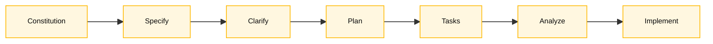

<!-- markdownlint-disable MD013 MD025 MD026 MD028 MD029 MD034 MD040 MD051 MD060 -->

# Spec-Kit — Cartão de Referência


> 🗺 **Você está aqui:** [Kit PT-BR](../README.md) → [Cheat-sheets](README.md) → **Spec-Kit workflow**

> **Para quem é isto?** Quem está no Estágio 2 e não sabe qual `/speckit.*` usar agora.
>
> **O que você terá ao final desta leitura:**
>
> 1. Sequência canônica: `specify` → `clarify` → `plan` → `tasks` → `analyze`
> 2. Mapping de comando × estágio × persona
> 3. Comandos de recovery quando o time pula uma etapa

  

> Repo oficial: <https://github.com/github/spec-kit>. Use o Spec-Kit oficial do
> GitHub para especificar, planejar, quebrar tarefas e implementar features.

## Quando usar

Use a partir do Estágio 2, quando o time transforma descobertas do legado em uma
funcionalidade especificada. O Spec-Kit ajuda a manter a sequência:

1. Constituição do projeto
2. Spec do que será construído
3. Plano técnico
4. Tasks implementáveis
5. Implementação guiada pela spec

Em termos simples: o Spec-Kit evita que o time pule direto para código. Primeiro
ele força a pergunta "o que vamos construir?", depois "como vamos construir?",
depois "quais tarefas executam isso?". Para o SIFAP, isso é essencial porque
cada decisão moderna precisa preservar uma regra encontrada no Natural/Adabas ou
deixar claro que é uma melhoria greenfield.

## Passo a passo rápido

Use esta sequência quando uma descoberta da arqueologia virar uma funcionalidade.

1. **Nomeie a funcionalidade.** Exemplo: `001-geracao-ciclo-pagamento`.
2. **Crie a spec com `/speckit.specify`.** Inclua user stories, critérios de aceitação e `source_legacy:`.
3. **Resolva dúvidas com `/speckit.clarify`.** Não siga com campos, regras ou fluxos ambíguos.
4. **Planeje com `/speckit.plan`.** O plano deve citar módulos, contratos, dados e riscos.
5. **Quebre em tarefas com `/speckit.tasks`.** Tarefa boa é pequena, testável e tem dono claro.
6. **Cheque consistência com `/speckit.analyze`.** Corrija lacunas antes de implementar.
7. **Implemente com `/speckit.implement`.** O código deve seguir `spec.md`, `plan.md` e `tasks.md`.

Resultado esperado: uma pasta `specs/<feature>/` com artefatos que explicam a
funcionalidade de ponta a ponta, do requisito ao código.

## Instalação oficial

Pré-requisitos: `uv`, Python 3.11+, Git e um agente compatível como GitHub
Copilot.

```bash
uv tool install specify-cli --from git+https://github.com/github/spec-kit.git@vX.Y.Z
specify version
```

Substitua `vX.Y.Z` pela versão mais recente publicada em
<https://github.com/github/spec-kit/releases>.

## Inicialização no repositório do time

```bash
specify init . --integration copilot
```

Isso instala templates, scripts e comandos do Spec-Kit para o GitHub Copilot. Em
macOS/Linux, os scripts ficam em `.specify/scripts/bash/`. As features geradas
pelos comandos vivem em `specs/<numero-nome-da-feature>/`.

## Comandos principais no Copilot

| Comando | Uso |
| --- | --- |
| `/speckit.constitution` | Cria ou atualiza princípios e regras do projeto |
| `/speckit.specify` | Cria a spec da funcionalidade com user stories e critérios |
| `/speckit.plan` | Gera o plano técnico a partir da spec |
| `/speckit.tasks` | Quebra o plano em tarefas implementáveis |
| `/speckit.implement` | Executa as tasks de implementação |

## Comandos opcionais úteis

| Comando | Uso |
| --- | --- |
| `/speckit.clarify` | Resolve ambiguidades antes do plano técnico |
| `/speckit.analyze` | Analisa consistência e cobertura entre artefatos |
| `/speckit.checklist` | Gera checklist de qualidade para a spec |
| `/speckit.taskstoissues` | Converte tasks em GitHub Issues |

## Os 6 padrões EARS

| # | Padrão | Modelo | Exemplo SIFAP |
| --- | --- | --- | --- |
| 1 | Ubiquitous | O sistema deverá [ação] | O SIFAP deverá registrar uma entrada de auditoria em toda alteração |
| 2 | Event-Driven | Quando [X], o sistema deverá [ação] | Quando um ciclo for gerado, criar pagamentos para beneficiários ativos |
| 3 | State-Driven | Enquanto [X], o sistema deverá [ação] | Enquanto estiver pendente, permitir cancelamento |
| 4 | Optional | Onde [escolha], o sistema deverá [ação] | Onde o usuário exportar, gerar CSV em UTF-8 |
| 5 | Unwanted | O sistema não deverá [ação] | O sistema não deverá permitir DELETE no log de auditoria |
| 6 | Complex | Enquanto [X], quando [Y], onde [Z], o sistema deverá [ação] | Enquanto estiver ativo, quando dezembro fechar, calcular o 13º benefício |

## Exemplo mínimo no SIFAP

Depois que o Par 1 encontra uma regra em `BATCHPGT.NSN`, o Requirements Engineer
pode abrir o Copilot no modo Ask e escrever:

```text
/speckit.specify
Funcionalidade: geração de ciclo de pagamento mensal.
Regra legado: quando o ciclo mensal é gerado, o SIFAP cria pagamentos apenas
para beneficiários ativos.
source_legacy: 01-arqueologia/legado-sifap/natural-programs/BATCHPGT.NSN#L120-L168
Critério: 10 beneficiários ativos + 2 suspensos produzem 10 pagamentos.
```

O resultado esperado em `spec.md` é uma regra rastreável, por exemplo:

```yaml
REQ-PAY-001:
  pattern: event-driven
  text: "Quando um ciclo de pagamento for gerado, o SIFAP deverá criar registros de pagamento para todo beneficiário com status ACTIVE."
  source_legacy: 01-arqueologia/legado-sifap/natural-programs/BATCHPGT.NSN#L120-L168
  acceptance: "10 ativos + 2 suspensos produzem 10 registros de pagamento."
```

Se esse requisito não tiver `source_legacy:`, ele ainda não está pronto para
seguir para `/speckit.plan`.

## Fluxo recomendado no workshop



| Momento | Comando | Entregável esperado |
| --- | --- | --- |
| Antes da primeira funcionalidade | `/speckit.constitution` | `.specify/memory/constitution.md` |
| Estágio 2 | `/speckit.specify` | `specs/<feature>/spec.md` |
| Estágio 2 | `/speckit.clarify` | Perguntas resolvidas na spec |
| Estágio 2 | `/speckit.plan` | `specs/<feature>/plan.md` |
| Estágio 3 | `/speckit.tasks` | `specs/<feature>/tasks.md` |
| Estágio 3 | `/speckit.analyze` | Lacunas e inconsistências antes de codar |
| Estágio 3 | `/speckit.implement` | Código guiado por spec + plan + tasks |

## Como adaptar ao SIFAP legado

- Inclua `source_legacy:` em todo requisito que nasceu de `.NSN` ou `.ddm`.
- Use `[GREENFIELD]` apenas quando não houver paralelo no legado e justifique.
- Antes de `/speckit.plan`, valide com Product Owner e Software Architect.
- Antes de `/speckit.implement`, confirme que `tasks.md` contém testes antes do
  código quando a mudança tocar regra de negócio.

## Dicas

- Não use pacote `specify-cli` aleatório do PyPI; a instalação oficial vem do
  repositório `github/spec-kit`.
- Se `uv` não existir, instale primeiro seguindo a documentação oficial.
- Se os comandos `/speckit.*` não aparecerem, rode `specify init . --integration
  copilot` novamente e recarregue o VS Code.
- Especificação é fonte de verdade. Se o código contradiz a spec, atualize a spec
  ou corrija o código antes de seguir.

## Referências

- [Spec-Kit no GitHub](https://github.com/github/spec-kit)
- [Documentação oficial](https://github.github.io/spec-kit/)
- [Guia de instalação](https://github.com/github/spec-kit/blob/main/docs/installation.md)
- [Spec-Driven Development](https://github.com/github/spec-kit/blob/main/spec-driven.md)
---

### Continuar a leitura

<table width="100%">
<tr>
<td width="50%" valign="top" align="left">
<sub><strong>← ANTERIOR</strong></sub><br/>
<a href="copilot-3-modes.md"><strong>Copilot em 3 modos</strong></a><br/>
<sub>Quando usar Ask, Plan ou Agent — tabela situação → modo.</sub>
</td>
<td width="50%" valign="top" align="right">
<sub><strong>PRÓXIMO →</strong></sub><br/>
<a href="model-routing.md"><strong>Roteamento de modelos</strong></a><br/>
<sub>Quando usar Haiku, Sonnet ou Opus — matriz custo × precisão.</sub>
</td>
</tr>
</table>

<sub>↑ <a href="../README.md">Voltar ao Kit PT-BR</a></sub>

— Paula
