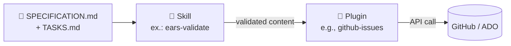

<!-- markdownlint-disable MD013 MD025 MD026 MD028 MD029 MD034 MD040 MD051 MD060 -->

# Plugins Compartilhados

 

> 🗺 **Você está aqui:** [Kit PT-BR](../README.md) → **Plugins**

> **Para quem é isto?** Para times que querem estender o Copilot com integrações externas (GitHub, Azure DevOps).
>
> **O que você terá ao final desta leitura:**
>
> 1. Entendimento do que é um plugin e quando usar
> 2. Lista de plugins disponíveis no kit
> 3. Como instalar e configurar

[← Kits de Persona](../05-personas/) |
[🏠 Início do Kit](../) |
[Próximo: Guias Rápidos →](../09-cheat-sheets/)

## O que fica aqui

Plugins são extensões reutilizáveis do Copilot disponíveis para **todas as
personas em todas as equipes**, sem ficarem limitados a uma única função. Eles
preenchem a lacuna entre as skills por persona (conhecimento específico de
função) e as APIs das ferramentas subjacentes (GitHub, Azure DevOps etc.).

Pense neles assim:

- **Agent** = quem a IA representa.
- **Skill** = o que a IA sabe fazer em um domínio.
- **Prompt** = uma receita pré-escrita que a IA pode executar.
- **Plugin** = uma ponte para um sistema externo que a IA pode acionar.

Um plugin encapsula uma API externa com padrões opinativos para que uma persona
não precise aprender o SDK bruto a cada uso.

## Plugins disponíveis

| Plugin | Finalidade | Quando usar |
| --- | --- | --- |
| [github-issues](github-issues.plugin.md) | Criar/sincronizar issues | Converter `TASKS.md` em trabalho rastreado |
| [azure-boards](azure-boards.plugin.md) | Sincronizar itens SDD | Equipes ADO com hierarquia Epic/Feature/Story |

## Como plugins se relacionam com skills

Uma **skill** prepara o conteúdo (valida EARS, refina histórias). Um
**plugin** entrega o conteúdo ao sistema de destino (GitHub, ADO, Jira). Essa
separação mantém o conhecimento reutilizável e a entrega intercambiável.

## Modelo de segurança

Todos os plugins seguem estes pontos inegociáveis:

- **Credenciais somente por variáveis de ambiente**. Nunca inline.
- **`dry_run: true` por padrão**. Visualize antes de gravar.
- **Rastreabilidade por REQ-ID preservada** em todas as direções de sincronização.
- **Escopo mínimo somente leitura** sempre que possível; escopos de escrita
  justificados por ferramenta.

## Adicionando um novo plugin

1. Copie um dos arquivos de plugin existentes como template.
2. Mantenha a mesma estrutura de 5 seções: O quê / Quando / Ferramentas /
   Configuração / Segurança.
3. Liste todas as ferramentas expostas pelo plugin, com uma subseção por ferramenta.
4. Documente o método de autenticação e o escopo obrigatório.
5. Abra um PR referenciando o REQ-ID que motivou o plugin.

## Navegação

[← Kits de Persona](../05-personas/) |
[🏠 Início do Kit](../) |
[Próximo: Guias Rápidos →](../09-cheat-sheets/)

---

### Continuar a leitura

<table width="100%">
<tr>
<td width="50%" valign="top" align="left">
<strong>← ANTERIOR</strong> 
<a href="../09-cheat-sheets/"><strong>Cheat-sheets</strong></a> 
Cartões de referência.
</td>
<td width="50%" valign="top" align="right">
<strong>PRÓXIMO →</strong> 
<a href="github-issues.plugin.md"><strong>Plugin: GitHub Issues</strong></a> 
Sincronizar issues.
</td>
</tr>
</table>

↑ <a href="../README.md">Voltar ao Kit PT-BR</a>

