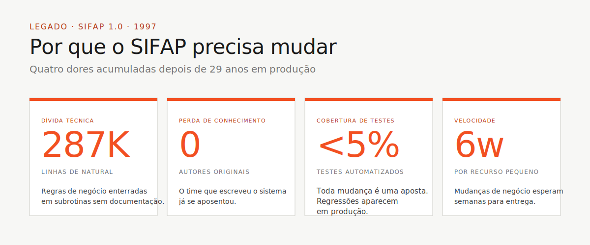

<!-- markdownlint-disable MD013 MD025 MD026 MD028 MD029 MD034 MD040 MD051 MD056 MD060 -->

# 🏰 Kit do Time — Workshop SIFAP 2.0 (PT-BR)


> 🎮 **A missão em uma frase:** você e 4 colegas têm **8 horas** para modernizar um sistema de pagamentos de **29 anos**. Cinco pares, quatro mundos, uma princesa para resgatar (= SIFAP 2.0 rodando ao vivo na demo).

---

## 🚪 Por onde começar (escolha sua porta)

| Eu sou… | Comece aqui |
|---|---|
| 🆕 **Primeira vez ou não-técnico** | [`00-COMECE-AQUI.md`](00-COMECE-AQUI.md) — 15 minutos guiados |
| 👨‍💻 **Dev, quero o cronograma** | [`00-TEAM-FLOW.md`](00-TEAM-FLOW.md) — 10 minutos |
| 🧠 **Quero entender os conceitos primeiro** | [`07-conceitos/`](07-conceitos/) — analogias Mario |
| 🛠 **Quero subir o ambiente** | [`00-SETUP.md`](00-SETUP.md) — laptop + Copilot |
| 🌿 **Como Git funciona neste workshop?** | [`00-GIT-WORKFLOW.md`](00-GIT-WORKFLOW.md) — branch por persona |
| 🆘 **Algo deu errado** | [`docs/troubleshooting.md`](docs/troubleshooting.md) |
| 🏆 **Sou o líder do time** | [`docs/CHECKLIST-LIDER.md`](docs/CHECKLIST-LIDER.md) — hora a hora |
| 🪦 **Quero evitar erros comuns** | [`docs/lessons-learned.md`](docs/lessons-learned.md) |
| 🎤 **Vou fazer a demo** | [`docs/demo-script.md`](docs/demo-script.md) |
| 📊 **Quero ver o progresso do dia** | [`docs/STATUS.md`](docs/STATUS.md) |

---

## 🍄 A analogia: o workshop é um co-op de Super Mario

```
                                                                       🏰
🟦 MUNDO 1 ──🟢cano──> 🟫 MUNDO 2 ──🟢cano──> 🟧 MUNDO 3 ──🟢cano──> CASTELO
@archaeologist          @architect              @builder              @evolution
(arqueologia)           (spec moderna)          (implementação)       (evolução)
                                                                          │
                                                                          ▼
                                                                     👸 SIFAP 2.0
                                                                       rodando!
```

- **5 jogadores** = 5 pessoas, cada uma com 2 personas (1 par)
- **4 mundos** = 4 estágios; cada um com um agente Copilot dedicado
- **Power-ups permanentes** = persona-kits (slash commands, skills)
- **Cano verde** = passagem entre estágios (5 min de conversa síncrona)
- **Estrela** = CI verde valida seu PR
- **Princesa** = demo do SIFAP 2.0 funcionando

📘 Entenda a analogia em detalhe → [`07-conceitos/02-agentes-como-super-mario.md`](07-conceitos/02-agentes-como-super-mario.md)

---

## 📍 Estrutura do kit (ordem de leitura recomendada)

```
📁 workspace/
├── 📜 README.md                       ← você está aqui
├── 📜 00-COMECE-AQUI.md               ← 15 min para qualquer pessoa
├── 📜 00-SETUP.md                     ← preparar laptop + Copilot
├── 📜 00-TEAM-FLOW.md                 ← cronograma canônico do dia
├── 📜 00-SITEMAP.md                   ← mapa visual do kit
├── 📜 00-GIT-WORKFLOW.md              ← branches, PRs, merges
│
├── 📁 01-arqueologia/                 🟦 ESTÁGIO 1 — ler legado SIFAP
│   ├── GUIDE.md                       (passo a passo do estágio)
│   ├── LEGACY-EXPLORATION-CHECKLIST.md (gate obrigatório!)
│   └── legado-sifap/                  📜 (15 .NSN + 4 DDMs + docs históricos)
├── 📁 02-spec-moderna/                🟫 ESTÁGIO 2 — escrever EARS, ADRs, C4
├── 📁 03-implementacao/               🟧 ESTÁGIO 3 — Java + Next.js + testes
├── 📁 04-evolucao/                    🏰 ESTÁGIO 4 — Agent mode + Terraform
│
├── 📁 05-personas/                    🧑‍🤝‍🧑 10 personas (escolha 2 = seu par)
├── 📁 06-agentes-de-estagio/          🌍 4 agentes Copilot (1 por mundo)
├── 📁 07-conceitos/                   🧠 analogias Mario (Lego/RPG/EARS)
├── 📁 08-exemplos/                    📘 artefatos completos prontos
├── 📁 09-cheat-sheets/                🎴 3 cartões de 1 página
├── 📁 11-scripts/                     🛠 setup.sh, check.sh
├── 📁 12-plugins/                     🔌 GitHub Issues, Azure Boards
│
├── 📁 docs/                           📚 FAQ, troubleshooting, runbook, ADRs
├── 📁 assets/                         🖼 SVGs e diagramas
└── 📁 specs/                          📋 exemplo Spec-Kit
```

---

## 🧑‍🤝‍🧑 Os 5 pares (escolha seu personagem)

Cada pessoa veste **um par** (duas personas) e fica com ele o dia inteiro.

| Par | Personas | 🍄 Personagem Mario | Fase do SDLC |
|---|---|---|---|
| **1 · Visão** | PO + Requirements Engineer | 👸 Peach + 📖 Toad | Descoberta + Especificação |
| **2 · Arquitetura** | Enterprise + Software Architect | 🌟 Rosalina + 🔷 Daisy | Especificação + Design |
| **3 · Implementação** | Technical Lead + Developer | 🟥 Mario + 🟩 Luigi | Implementação + Evolução |
| **4 · Qualidade** | DBA + QA Engineer | 🦖 Yoshi + 🐢 Koopa | Implementação (dados + testes) |
| **5 · Operações** | DevOps + Tech Writer | 🍄 Captain Toad + 🎺 Bardo | Transversal + Evolução |

📘 Detalhe de cada papel → [`05-personas/OVERVIEW.md`](05-personas/OVERVIEW.md)

---

## ⚙️ Ferramentas aprovadas — somente estas

> [!IMPORTANT]
> O workshop roda em **stack fixa**. Misturar ferramentas alternativas fragmenta o time e quebra a rastreabilidade spec → código → teste.

| ✅ Use | ❌ Não use |
|---|---|
| **VS Code** (ou Insiders) | Cursor, Windsurf, Antigravity, IntelliJ, Eclipse |
| **GitHub Copilot** (Ask + Plan + Agent) | Codex, Cline, Continue, Aider, Codeium, Tabnine |
| **GitHub Copilot CLI** *(opcional)* | UIs web de chat para gerar código |
| **Spec-Kit oficial** (`Specify CLI`) | Kiro, frameworks SDD alternativos |
| **GitHub** (Issues, PRs, Actions) | — |
| **Docker / Docker Compose** | Instalações locais que divergem do devcontainer |
| **Terraform** (Azure provider) | `terraform apply` (só `plan`!) |

O racional completo e o que o CI verifica estão em [`.github/copilot-instructions.md`](.github/copilot-instructions.md).

---

## 🎮 Duas camadas de agente — ambas obrigatórias

O kit traz **duas camadas** que cobrem eixos diferentes (papel × estágio). Use as duas.

| Camada | O que é | Quando carrega | Como |
|---|---|---|---|
| [`05-personas/`](05-personas/) | Seu **personagem** (Mario, Peach…) com inventário (prompts, skills, MCP) | Uma vez no setup | `cp -r 05-personas/XX-*/.github/* .github/` |
| [`06-agentes-de-estagio/`](06-agentes-de-estagio/) | O **mundo atual** (@archaeologist → @evolution) | A cada estágio | Seletor de agentes no Copilot Chat |

**Não são duplicados.** Persona = sua classe individual. Agente = mundo em que o time todo está agora.

📘 Explicação completa → [`07-conceitos/02-agentes-como-super-mario.md`](07-conceitos/02-agentes-como-super-mario.md)

---

## 🌿 Git: cada persona em sua branch

Cada par trabalha em **sua própria branch**, abre **Pull Request** para `develop`, recebe **review do par downstream**, mergeia. Ao fim do dia, líder mergeia `develop → main`.

```
spec/<NNN>-...        ← Estágio 2 (RE+SA)
impl/<modulo>-...     ← Estágio 3 (Dev+DBA)
test/<feature>        ← Estágio 3 (QA)
infra/<componente>    ← Estágio 4 (DevOps)
docs/<topico>         ← Transversal (TW)
agent/<issue-NN>      ← Estágio 4 (Copilot Agent)
```

📘 Detalhes + comandos salvadores → [`00-GIT-WORKFLOW.md`](00-GIT-WORKFLOW.md)

---

## 🚀 Como usar este kit (3 passos)

### 1. Setup inicial (uma vez, ~45 min)

```bash
# Clone, bootstrap, e abra no VS Code
cd ~/Code
git clone <url-do-repo-do-seu-time> hackathon-team-XX
cd hackathon-team-XX
./11-scripts/setup.sh
code .
# Depois: Cmd+Shift+P > "Dev Containers: Reopen in Container"
```

📘 Detalhes em [`00-SETUP.md`](00-SETUP.md)

### 2. Pré-aquecimento (~30 min, cada pessoa)

```bash
# 1. Cronograma do dia
cat 00-TEAM-FLOW.md

# 2. Conceitos com analogia Mario (não-devs: comece aqui)
cat 07-conceitos/00-README.md

# 3. Suas 2 personas
cat 05-personas/XX-persona-A/PERSONA.md
cat 05-personas/YY-persona-B/PERSONA.md

# 4. Copie SEUS kits para o .github/ do repo
cp -r 05-personas/XX-persona-A/.github/* .github/
cp -r 05-personas/YY-persona-B/.github/* .github/
```

### 3. Dia do workshop — siga os 4 estágios

```
🟦 01-arqueologia/GUIDE.md   ← ler legado, extrair regras
🟫 02-spec-moderna/GUIDE.md  ← EARS, ADRs, C4
🟧 03-implementacao/GUIDE.md ← Java + Next.js + testes
🏰 04-evolucao/GUIDE.md      ← Agent mode + Terraform
```

---

## 🎯 Por que isso importa

A maioria dos projetos de modernização falha não porque o time não sabe escrever Java, mas porque escreve Java para o **problema errado**. Modernizam o brief, não o sistema. Perdem 29 anos de regras de negócio enterradas em código que ninguém lê.



Este kit existe para impedir isso:

- 📜 O código legado vem junto (em [`01-arqueologia/legado-sifap/`](01-arqueologia/legado-sifap/))
- ⭐ A rastreabilidade (`source_legacy:`) é exigida pelo CI
- 🟢 Os canos verdes (passagens H1, H2, H3) estão agendados
- 🧑‍🤝‍🧑 Os papéis são explícitos (10 PERSONA.md)
- 📘 Você não precisa **inventar** o processo; precisa **executá-lo**.

---

## 📜 Contrato didático deste kit (5 regras)

Todo documento aqui segue 5 regras:

1. 📍 **Contexto primeiro** — onde isso encaixa no SDLC e por que importa
2. 👣 **Passo a passo executável** — comandos, checklist ou sequência
3. 🎯 **Exemplo concreto** — sempre exemplos SIFAP, nunca abstrato
4. ✅ **Critério de pronto** — como saber que terminou
5. 🆘 **Solução de problemas** — onde há risco operacional, há seção de troubleshooting

---

## 🍄 Glossário mínimo (1 frase cada)

| Termo | 🍄 Em uma frase |
|---|---|
| **EARS** | Receita exata de requisito (sem "a gosto") |
| **ADR** | Carta da Princesa explicando uma decisão |
| **Spec-Kit** | Mario Maker — desenhe a fase antes de jogar |
| **Persona-kit** | Seu personagem + inventário do dia |
| **Agent-kit** | O mundo atual (1-1, 2-1, 3-1, castelo) |
| **source_legacy** | Moeda numerada provando origem no `.NSN` |
| **Bounded context** | Departamento da empresa (RH, Pagamento...) |
| **CI verde** | Estrela de invencibilidade |

📘 Glossário completo com 30+ termos → [`07-conceitos/03-glossario-visual.md`](07-conceitos/03-glossario-visual.md)

---

### Continuar a leitura

<table width="100%">
<tr>
<td width="50%" valign="top"></td>
<td width="50%" valign="top" align="right">
<sub><strong>PRÓXIMO →</strong></sub><br/>
<a href="00-COMECE-AQUI.md"><strong>00 — Comece aqui</strong></a><br/>
<sub>15 minutos guiados para qualquer pessoa.</sub>
</td>
</tr>
</table>

— Paula
