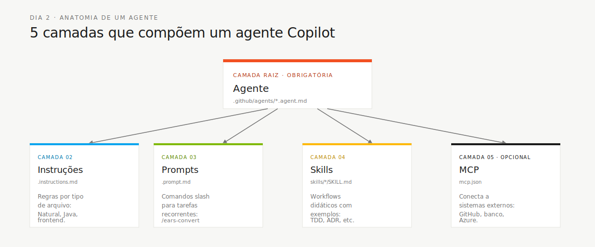

<!-- markdownlint-disable MD013 MD025 MD026 MD028 MD029 MD034 MD040 MD051 MD060 -->

# Os 4 Agentes do SDLC — Explicados

 

> 🗺 **Você está aqui:** [Kit PT-BR](../README.md) → [Docs](README.md) → **4 Agents Explained**

> **Para quem é isto?** Documentação transversal usada durante o workshop.
>
> **O que você terá ao final desta leitura:** contexto adicional sobre o tópico do título.


Este documento explica a lógica por trás dos quatro agentes de etapa do workshop. Leia quando alguém perguntar: "por que temos agentes de etapa se cada persona já tem seu próprio kit?"

## A ideia em uma frase

- **Persona-kit** responde: "qual é o meu papel?"
- **Agent-kit** responde: "como o time trabalha agora, nesta etapa?"

Os dois são necessários. Uma pessoa pode estar usando as personas Developer + Technical Lead, mas no Estágio 1 ela ainda deve seguir o `@archaeologist`, porque o time inteiro está lendo legado.

## Por que são 4 agentes

O workshop tem quatro modos de trabalho. Cada modo exige comportamento diferente do Copilot.

| Etapa | Modo cognitivo | Agente | Regra principal |
| --- | --- | --- | --- |
| 1 · Arqueologia | Observar e catalogar | `@archaeologist` | Não escrever código |
| 2 · Spec Moderna | Estruturar e decidir | `@architect` | Não aceitar requisito sem evidência |
| 3 · Implementação | Construir e verificar | `@builder` | Não codar sem REQ-ID e teste |
| 4 · Evolução | Delegar e revisar | `@evolution` | Não aceitar PR de IA sem revisão |

Um agente único teria instruções conflitantes: no Estágio 1 ele precisa ser read-only; no Estágio 3 precisa editar e testar. Separar por etapa torna a experiência mais segura e mais clara para iniciantes.

## Anatomia de um agente



| Camada | Para que serve | Exemplo |
| --- | --- | --- |
| Agente | Define missão, ferramentas e comportamento | `@builder` sabe implementar e testar |
| Instruções | Regras sensíveis ao tipo de arquivo | Natural/Adabas, Java, frontend |
| Prompts | Ações reutilizáveis | `/translate-natural-to-java`, `/write-ears-spec` |
| Skills | Guia mais profundo para uma técnica | TDD, ADR, extração de regra |
| MCP | Conecta o agente a sistemas externos | GitHub, banco, Azure quando configurado |

## Passo a passo de uso no dia

1. **Comece pela etapa, não pela vontade individual.** Veja o horário em [00-TEAM-FLOW.md](../00-TEAM-FLOW.md).
2. **Selecione o agente de etapa no Copilot Chat.** Exemplo: `@architect` no Estágio 2.
3. **Leia também seu `PERSONA.md`.** Ele diz o que você, pessoa, deve observar naquela etapa.
4. **Use os prompts do stage.** Eles transformam conversa em artefato.
5. **Pare no gate.** Só avance quando a Definição de Pronto da etapa estiver cumprida.

## Exemplo concreto

Durante o Estágio 2, o Requirements Engineer quer escrever requisitos, mas quem coordena a etapa é o Software Architect com `@architect`.

```text
@architect
Temos esta regra extraída de BATCHPGT.NSN:
"Quando o ciclo mensal roda, pagamentos são gerados apenas para beneficiários ativos."
Ajude a transformar em EARS com REQ-ID, critérios de aceite e source_legacy.
```

O agente ajuda a transformar a descoberta em algo implementável:

```yaml
REQ-PAY-001:
  pattern: event-driven
  text: "Quando um ciclo de pagamento for gerado, o SIFAP deverá criar registros de pagamento para todo beneficiário com status ACTIVE."
  source_legacy: 01-arqueologia/legado-sifap/natural-programs/BATCHPGT.NSN#L120-L168
  acceptance: "10 ativos + 2 suspensos produzem 10 registros de pagamento."
```

## Regra no-silver-platter

Os agentes ensinam o caminho, mas não entregam a resposta pronta sem evidência. Isso protege o aprendizado e evita alucinação.

| Se você pedir... | O agente deve responder... |
| --- | --- |
| "Diga quais são os bounded contexts" | "Mostre o catálogo de programas e o mapa de dados." |
| "Crie requisitos para tudo" | "Vamos começar por uma regra com fonte no legado." |
| "Implemente esta funcionalidade sem spec" | "Falta REQ-ID, critério de aceitação e source_legacy." |

## Como saber que entendeu

Você entendeu o modelo quando consegue explicar estas três frases para outra pessoa:

1. Persona-kit é papel; agent-kit é etapa.
2. O agente de etapa muda ao longo do dia; suas duas personas continuam as mesmas.
3. Todo artefato importante precisa sobreviver fora do chat, em arquivo versionado.

## Referências

- [Kits de agentes](../06-agentes-de-estagio/README.md)
- [Matriz persona-agente](persona-agent-matrix.md)
- [Fluxo SDLC completo](sdlc-flow-guide.md)
- [Persona Kits](../05-personas/README.md)

## Navegação

| Anterior | Início | Próximo |
| --- | --- | --- |
| [Matriz Persona-Agente](persona-agent-matrix.md) | [Kit PT-BR](../README.md) | [Kits de agentes](../06-agentes-de-estagio/README.md) |

— Paula


---

### Continuar a leitura

<table width="100%">
<tr>
<td width="50%" valign="top" align="left">
<sub><strong>← ANTERIOR</strong></sub><br/>
<a href="persona-agent-matrix.md"><strong>Persona-agent matrix</strong></a><br/>
<sub>Matriz de papéis.</sub>
</td>
<td width="50%" valign="top" align="right">
<sub><strong>PRÓXIMO →</strong></sub><br/>
<a href="sdlc-flow-guide.md"><strong>SDLC flow</strong></a><br/>
<sub>Fluxo do SDLC.</sub>
</td>
</tr>
</table>

<sub>↑ <a href="../README.md">Voltar ao Kit PT-BR</a></sub>

