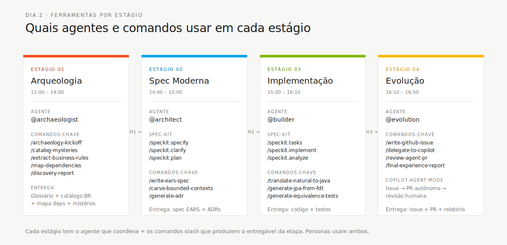

<!-- markdownlint-disable MD013 MD025 MD026 MD028 MD029 MD034 MD040 MD051 MD060 -->

# Fluxo SDLC — Personas × Agentes × Etapas

 

> 🗺 **Você está aqui:** [Kit PT-BR](../README.md) → [Docs](README.md) → **SDLC Flow**

> **Para quem é isto?** Documentação transversal usada durante o workshop.
>
> **O que você terá ao final desta leitura:** contexto adicional sobre o tópico do título.


> **Este é o mapa que faltava.** O seu cartão de persona diz _o que você possui_. O kit de agente diz _como a IA ajuda_. Este documento diz _quando tudo se conecta_ — o fluxo completo de 8 horas, com cada passagem, cada troca de agente e cada entregável em sequência.

Imprima esta página. Deixe-a fixada ao lado da sua tela. Ela é o seu GPS do dia.

## Visão Completa


## Etapa por Etapa: Quem, Qual Agente, Quais Prompts, Quais Entregáveis

### Etapa 1 — Arqueologia (13:00–14:15)

**Agente:** `@archaeologist` (Claude Opus 4.7, somente leitura)

| Persona                   | Papel          | O Que Você Faz                                                                                                                           | Prompts Que Você Executa                          |
| ------------------------- | -------------- | ---------------------------------------------------------------------------------------------------------------------------------------- | ------------------------------------------------- |
| **Requirements Engineer** | 🔑 Protagonista | Abra `01-arqueologia/legado-sifap/` e conduza uma exploração sistemática. Extraia regras de negócio de cada programa. Assuma o catálogo de regras de negócio. | `/archaeology-kickoff`, `/extract-business-rules` |
| Tech Writer               | Secundária      | Construa o glossário de domínio em tempo real. Cada novo termo recebe uma definição.                                                     | Trabalha junto com RE, sem prompt dedicado        |
| Enterprise Architect      | Secundária      | Mapeie limites do sistema: quais sistemas externos o legado chama? De onde vêm as entradas batch?                                        | `/map-dependencies` (escopo = interfaces externas) |
| DBA                       | Secundária      | Foque nos DDMs. Documente tipos de campo, estruturas MU/PE e relações entre arquivos.                                                    | `/map-dependencies` (escopo = DDMs)                |
| Product Owner             | Observadora       | Ouça e valide. Quando uma interpretação de regra de negócio for proposta, confirme ou questione.                                         | —                                                 |
| Software Architect        | Observadora       | Comece a pensar em quais clusters de código podem virar bounded contexts.                                                                | —                                                 |
| Technical Lead            | Observadora       | Observe padrões de qualidade de código — o que será difícil traduzir na Etapa 3?                                                         | —                                                 |
| QA Engineer               | Observadora       | Observe quais regras não têm apoio documental (elas precisarão de testes extras depois).                                                 | —                                                 |
| DevOps Engineer           | Observadora       | Observe pistas de infraestrutura: agendas batch, dependências de arquivos, variáveis de ambiente.                                        | —                                                 |

**Gate:** Antes de sair da Etapa 1, o RE executa `/discovery-report`. Se qualquer um dos 4 artefatos de entrada estiver ausente, o prompt se recusa a gerar o relatório. Este é o gate de qualidade.

**Passagem #1 (14:15):** O Requirements Engineer apresenta o relatório de descoberta ao Software Architect em um standup de 5 minutos. O PO confirma quais achados têm maior prioridade.

---

### Etapa 2 — Especificação Moderna (14:00–15:00)

**Agente:** `@architect` (Claude Opus 4.7, somente leitura)

| Persona                | Papel          | O Que Você Faz                                                                                               | Prompts Que Você Executa                              |
| ---------------------- | -------------- | ------------------------------------------------------------------------------------------------------------ | ----------------------------------------------------- |
| **Software Architect** | 🔑 Protagonista | Avalie hipóteses de separação a partir do relatório de descoberta. Desenhe diagramas C4. Defina limites de módulos. | `/carve-bounded-contexts`, `/design-modular-monolith` |
| Requirements Engineer  | Secundária      | Transforme regras de negócio confirmadas em requisitos EARS. Todo REQ precisa de rastreabilidade de origem.  | `/write-ears-spec`                                    |
| Enterprise Architect   | Secundária      | Valide o diagrama de contexto do sistema. Revise ADRs para alinhamento empresarial.                          | `/generate-adr` (decisões relacionadas à integração)  |
| Product Owner          | Secundária      | Priorize requisitos. Com 2 horas para implementação, o time não consegue construir tudo.                     | Participa das discussões de `/carve-bounded-contexts` |
| Technical Lead         | Observadora       | Planeje a ordem de implementação: qual bounded context primeiro? Quais são as dependências?                  | —                                                     |
| Todos os demais        | Observadora       | Revise a especificação emergente. Sinalize qualquer coisa incompleta a partir da sua perspectiva.            | —                                                     |

**Gate:** SPECIFICATION.md existe com ≥10 requisitos EARS. Pelo menos 3 ADRs. Mapa de bounded contexts com diagrama Mermaid. Esqueleto OpenAPI.

**Passagem #2 (16:00):** O Software Architect apresenta o design ao Tech Lead e ao Developer em um standup de 5 minutos. O DBA recebe a seção de modelo de dados. O QA Engineer recebe os critérios de aceite.

---

### Etapa 3 — Implementação (15:00–16:10)

**Agente:** `@builder` (Claude Sonnet 4.6, acesso completo para editar + executar)

| Persona            | Papel          | O Que Você Faz                                                                                                                        | Prompts Que Você Executa                                   |
| ------------------ | -------------- | ------------------------------------------------------------------------------------------------------------------------------------- | ---------------------------------------------------------- |
| **Developer**      | 🔑 Protagonista | Escreva código. Traduza Natural para Java, construa endpoints REST, crie páginas Next.js. Cada commit rastreia para um REQ-ID.        | `/translate-natural-to-java`, `/implement-rest-controller` |
| DBA                | Secundária      | Assuma a camada de dados. Revise entidades JPA, escreva migrações Flyway, valide o schema PostgreSQL.                                 | `/generate-jpa-from-fdt`                                   |
| QA Engineer        | Secundária      | Escreva testes junto com o Developer. Monitore cobertura. Execute testes de equivalência.                                             | `/generate-equivalence-tests`                              |
| Technical Lead     | Secundária      | Revise código conforme ele chega. Verifique violações de padrões. Faça merge de PRs. Execute a revisão de segurança antes da Etapa 4. | `/security-self-review`                                    |
| Software Architect | Secundária      | Valide se a implementação corresponde ao design. Se o Developer se desviar dos limites de bounded context, sinalize.                  | —                                                          |
| Product Owner      | Observadora       | Disponível para esclarecimento de domínio. "Isso deve rejeitar ou alertar?" — somente o PO pode responder.                            | —                                                          |
| Todos os demais    | Observadora       | Disponíveis quando sua especialidade for necessária.                                                                                  | —                                                          |

**Gate:** `mvn verify` passa. `npm run build` passa. Cobertura de testes backend ≥60%. Pelo menos 3 endpoints REST funcionando. Pelo menos 2 páginas Next.js.

**Passagem #3 (17:00):** O Tech Lead confirma que o protótipo funciona e apresenta a estrutura do codebase ao DevOps Engineer. O QA Engineer continua testando.

---

### Etapa 4 — Evolução (16:10–16:50)

**Agente:** `@evolution` (Claude Sonnet 4.6, acesso para editar + GitHub)

| Persona            | Papel          | O Que Você Faz                                                                                                             | Prompts Que Você Executa                                                |
| ------------------ | -------------- | -------------------------------------------------------------------------------------------------------------------------- | ----------------------------------------------------------------------- |
| **Technical Lead** | 🔑 Protagonista | Escreva GitHub Issues para Copilot Agent. Revise PRs gerados por IA. Assuma a decisão de merge. Prepare a demo.            | `/write-github-issue`, `/delegate-to-copilot-agent`, `/review-agent-pr` |
| DevOps Engineer    | Secundária      | Escreva o fluxo de trabalho do GitHub Actions. Crie módulos Terraform para Azure.                                           | Trabalha diretamente, sem prompt dedicado                               |
| QA Engineer        | Secundária      | Valide gates de qualidade no pipeline de CI. Revise resultados de testes de PRs gerados por IA.                            | —                                                                       |
| Developer          | Secundária      | Revise código gerado por IA. Você conhece melhor o codebase — encontre erros que verificações automatizadas deixam passar. | Ajuda com `/review-agent-pr`                                            |
| Tech Writer        | Secundária      | Dê acabamento ao README. Escreva o roteiro da demo. Garanta que as notas da retrospectiva capturem os aprendizados.        | —                                                                       |
| Product Owner      | Secundária      | Priorize o que precisa funcionar na demo versus o que pode ser adiado. Prepare a narrativa.                                | —                                                                       |
| Todos os demais    | Observadora       | Contribuam com observações para a retrospectiva.                                                                           | `/final-experience-report` (todos respondem)                            |

**Gate:** Pipeline de CI executa. Pelo menos 1 módulo Terraform. Pelo menos 1 PR gerado por IA revisado. Roteiro da demo pronto.

---

## Checklist de Passagem

Cada passagem é um standup de 5 minutos entre os protagonistas de saída e de entrada. Use este checklist:

| Passagem              | De → Para     | Artefato Passado                                  | Pergunta a Confirmar                                                       |
| -------------------- | ------------- | ------------------------------------------------- | -------------------------------------------------------------------------- |
| **#1** (Etapa 1 → 2) | RE → SA       | `discovery-report.md`                             | "Você tem informação suficiente para separar contextos?"                   |
| **#2** (Etapa 2 → 3) | SA → TL + Dev | `SPECIFICATION.md` + `modular-monolith-design.md` | "Você sabe qual contexto construir primeiro?"                              |
| **#3** (Etapa 3 → 4) | TL → DevOps   | Protótipo funcional (build verde)                 | "Você consegue executar isso localmente? O que precisa para fazer deploy?" |

Se a resposta à pergunta de confirmação for **não**, o time tem 10 minutos para preencher a lacuna antes que a próxima etapa comece. Use a regra dos 20 minutos: se ainda estiverem presos após mais 10 minutos, escalem para um facilitador.

## Como Persona-Kits e Agent-Kits Trabalham Juntos

```text
Você é Developer.

Passo 1: Leia o seu PERSONA.md         → 05-personas/06-developer/PERSONA.md
        (o que você possui, suas passagens, sua rubrica)

Passo 2: Copie o seu PERSONA-KIT       → 05-personas/06-developer/.github/ → .github/
        (seu agente Copilot pessoal, prompts, skills)

Passo 3: Verifique AGENTES QUE USO     → tabela "Agentes que uso" no seu cartão de persona
    (seu papel em cada etapa: Protagonista/Secundária/Observadora)

Passo 4: Quando uma nova etapa começar → Abra o README do AGENT-KIT dessa etapa
                                          06-agentes-de-estagio/03-builder/README.md
        (como ativar, prompts a executar, Definição de Pronto)

Passo 5: Ative o AGENTE DE ETAPA       → Selecione @builder no Copilot Chat
        (o agente carrega a partir de .github/agents/builder.agent.md)

Passo 6: Execute PROMPTS               → /translate-natural-to-java, /generate-jpa-from-fdt
        (o agente guia você pelo trabalho)

Passo 7: Ao final da etapa             → Verifique a DEFINIÇÃO DE PRONTO
        (o README do agent-kit lista os critérios do gate)

Passo 8: PASSAGEM                      → Apresente seus entregáveis ao próximo protagonista
```

O seu **agente do persona-kit** (por exemplo, `@developer`) conhece profundamente o seu papel — idioms Java, padrões Spring, convenções de teste. O **agente de etapa** (por exemplo, `@builder`) conhece o _processo_ — quais prompts executar, quais entregáveis produzir, como é a Definição de Pronto. Use ambos. Eles se complementam.

## Cartão de Referência Rápida

| Horário | Etapa              | Agente           | Protagonista          | Prompt-Chave                 | Entregável-Chave            |
| ------- | ------------------ | ---------------- | --------------------- | ---------------------------- | --------------------------- |
| 13:00   | 1 - Arqueologia    | `@archaeologist` | Requirements Engineer | `/discovery-report`          | `discovery-report.md`       |
| 14:00   | 2 - Spec Moderna   | `@architect`     | Software Architect    | `/design-modular-monolith`   | `SPECIFICATION.md` + design |
| 15:00   | 3 - Implementação  | `@builder`       | Developer             | `/translate-natural-to-java` | Protótipo funcional         |
| 16:10   | 4 - Evolução       | `@evolution`     | Technical Lead        | `/write-github-issue`        | CI/CD + PR de IA revisado   |

---

## Como os 4 Agentes de Etapa Trabalham Com Spec-Kit

O kit tem duas camadas de ferramentas de IA. Elas não são alternativas — elas são complementares e usadas em momentos específicos.

| Ferramenta                                                                    | O Que É                                                              | Quando Usar                                             | Cartão de Referência                                                    |
| ----------------------------------------------------------------------------- | -------------------------------------------------------------------- | ------------------------------------------------------- | ----------------------------------------------------------------------- |
| **4 agentes de etapa** (`@archaeologist`, `@architect`, `@builder`, `@evolution`) | Agentes VS Code Copilot com prompts específicos por etapa            | Ao longo do dia — um agente por etapa                   | [`06-agentes-de-estagio/`](../06-agentes-de-estagio/README.md)                             |
| **Spec-Kit** (`specify` + `/speckit.*`) | Conjunto oficial do GitHub para spec, plano, tasks e implementação guiada | Etapas 2 e 3, com apoio no Estágio 4 | [`09-cheat-sheets/spec-kit-workflow.md`](../09-cheat-sheets/spec-kit-workflow.md) |

### O Fluxo Recomendado



### Etapa por Etapa: Quando Usar O Quê

**Etapa 1 — Arqueologia**
Use apenas `@archaeologist`. O Spec-Kit entra depois, quando as descobertas já podem virar uma funcionalidade especificada.

**Etapa 2 — Especificação Moderna** (é aqui que as três ferramentas convergem)

| Passo                        | Ferramenta                                                                 | O Que Produz                                 |
| ---------------------------- | -------------------------------------------------------------------------- | -------------------------------------------- |
| 1. Criar spec                | **Spec-Kit** `/speckit.specify`                                             | `specs/<feature>/spec.md`                    |
| 2. Revisão do PO (10 min)    | Humano                                                                     | Prioridades e escopo confirmados             |
| 3. Clarificar                | **Spec-Kit** `/speckit.clarify`                                             | Ambiguidades resolvidas                      |
| 4. Separar bounded contexts  | **@architect** `/carve-bounded-contexts`                                   | `bounded-contexts.md` com diagrama Mermaid   |
| 5. Planejar implementação    | **Spec-Kit** `/speckit.plan` + revisão do Architect                        | `plan.md` + contratos                        |
| 6. Gerar ADRs                | **@architect** `/generate-adr`                                             | `ADRs/adr-NNN-*.md`                          |
| 7. Quebrar tasks             | **Spec-Kit** `/speckit.tasks`                                              | `tasks.md`                                   |
| 8. Gate de qualidade         | **Spec-Kit** `/speckit.analyze`                                            | Lacunas e inconsistências                    |

O agente `@architect` guia o pensamento do time; o Spec-Kit formaliza a saída em artefatos versionados dentro de `specs/<feature>/`.

### Etapa 3 — Implementação

| Passo                   | Ferramenta                                 | O Que Produz                                            |
| ----------------------- | ------------------------------------------ | ------------------------------------------------------- |
| 1. Planejar tasks       | **Spec-Kit** `/speckit.tasks`              | `tasks.md` com ordem de dependências                    |
| 2. Traduzir + construir | **@builder** prompts                       | Serviços Java, entidades JPA, API REST, páginas Next.js |
| 3. Gerar testes         | **@builder** `/generate-equivalence-tests` | Arquivos de teste JUnit + Vitest                        |
| 4. Verificar cobertura  | **Spec-Kit** `/speckit.analyze` + QA       | Lacunas de cobertura contra REQ-IDs                     |
| 5. Revisão de segurança | **@builder** `/security-self-review`       | Checklist OWASP                                         |

O agente `@builder` escreve código. O Spec-Kit mantém spec, plan e tasks como fonte de verdade para rastreabilidade.

### Etapa 4 — Evolução

| Passo                        | Ferramenta                                | O Que Produz                            |
| ---------------------------- | ----------------------------------------- | --------------------------------------- |
| 1. Escrever + delegar issues | **@evolution** prompts                    | GitHub Issues para Copilot Agent        |
| 2. Revisar PRs da IA         | **@evolution** `/review-agent-pr`         | Revisão com achados classificados       |
| 3. Preparar release          | **@evolution** + Spec-Kit artifacts       | PR com resumo da spec + gate de release |
| 4. Retro do time             | **@evolution** `/final-experience-report` | Agent experience report                 |

### Decisão Rápida: Qual Ferramenta Agora?

| Preciso...                                 | Usar                                                          |
| ------------------------------------------ | ------------------------------------------------------------- |
| Explorar código legado                     | `@archaeologist`                                              |
| Rascunhar rapidamente uma ideia de funcionalidade | **Spec-Kit**                                          |
| Escrever requisitos EARS formais           | **Spec-Kit** `/speckit.specify` + `/speckit.clarify`          |
| Desenhar diagramas C4                      | `@architect` + plano gerado por `/speckit.plan`               |
| Decidir bounded contexts                   | `@architect` `/carve-bounded-contexts`                        |
| Traduzir Natural para Java                 | `@builder` `/translate-natural-to-java`                       |
| Verificar cobertura de testes contra REQs  | **Spec-Kit** `/speckit.analyze` + QA                          |
| Escrever uma GitHub Issue para Copilot     | `@evolution` `/write-github-issue`                            |
| Executar o fluxo Spec-Kit completo         | `/speckit.specify` → `/speckit.plan` → `/speckit.tasks` → `/speckit.implement` |

---

## Onde Encontrar Tudo

| O que você precisa                        | Onde fica                                                                           |
| ----------------------------------------- | ----------------------------------------------------------------------------------- |
| Seu papel e passagens                      | [`05-personas/<your-role>/PERSONA.md`](../05-personas/)                           |
| Seu agente Copilot + prompts + skills     | [`05-personas/<your-role>/`](../05-personas/)                                     |
| O agente de etapa para a etapa atual      | [`06-agentes-de-estagio/<NN>-<stage>/README.md`](../06-agentes-de-estagio/)                               |
| O arquivo de agente que o Copilot carrega | [`.github/agents/<agent>.agent.md`](../.github/agents/)                             |
| Os prompts que você invoca                | [`.github/prompts/<agent>/`](../.github/prompts/)                                   |
| Os templates de entregáveis               | `01-arqueologia/templates/`, `02-spec-moderna/templates/`, `04-evolucao/templates/` |
| Cartão de referência do Spec-Kit          | [`09-cheat-sheets/spec-kit-workflow.md`](../09-cheat-sheets/spec-kit-workflow.md)         |
| Início rápido do Spec-Kit                 | [`00-SETUP.md` Passo 9](../00-SETUP.md)                                                   |
| Matriz completa 10×4 de persona-agente    | [`docs/persona-agent-matrix.md`](persona-agent-matrix.md)                           |
| Explicação da arquitetura dos agentes     | [`docs/4-agents-explained.md`](4-agents-explained.md)                               |
| Linha do tempo diária e regras de passagem | [`00-TEAM-FLOW.md`](../00-TEAM-FLOW.md)                                                   |

---

| Anterior                     | Início                                     | Próximo                                  |
| ---------------------------- | ------------------------------------------ | ---------------------------------------- |
| [Fluxo do Time](../00-TEAM-FLOW.md) | [Página Inicial do Kit do Time](../README.md) | [Kits de agentes](../06-agentes-de-estagio/README.md) |


---

### Continuar a leitura

<table width="100%">
<tr>
<td width="50%" valign="top" align="left">
<sub><strong>← ANTERIOR</strong></sub><br/>
<a href="persona-agent-matrix.md"><strong>Persona-agent matrix</strong></a><br/>
<sub>Matriz de papéis.</sub>
</td>
<td width="50%" valign="top" align="right">
<sub><strong>PRÓXIMO →</strong></sub><br/>
<a href="runbook.md"><strong>Runbook</strong></a><br/>
<sub>Operação do ambiente.</sub>
</td>
</tr>
</table>

<sub>↑ <a href="../README.md">Voltar ao Kit PT-BR</a></sub>

